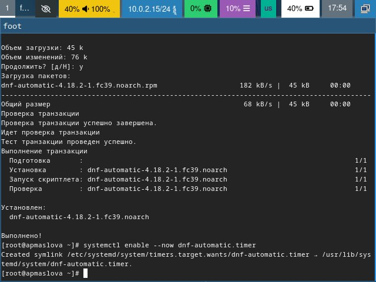

---
## Front matter
title: "Отчёт по лабораторной работе №1"
author: "Маслова Анна Павловна"

## Generic otions
lang: ru-RU
toc-title: "Содержание"

## Bibliography
bibliography: bib/cite.bib
csl: pandoc/csl/gost-r-7-0-5-2008-numeric.csl

## Pdf output format
toc: true # Table of contents
toc-depth: 2
lof: true # List of figures
lot: true # List of tables
fontsize: 12pt
linestretch: 1.5
papersize: a4
documentclass: scrreprt
## I18n polyglossia
polyglossia-lang:
  name: russian
  options:
	- spelling=modern
	- babelshorthands=true
polyglossia-otherlangs:
  name: english
## I18n babel
babel-lang: russian
babel-otherlangs: english
## Fonts
mainfont: PT Serif
romanfont: PT Serif
sansfont: PT Sans
monofont: PT Mono
mainfontoptions: Ligatures=TeX
romanfontoptions: Ligatures=TeX
sansfontoptions: Ligatures=TeX,Scale=MatchLowercase
monofontoptions: Scale=MatchLowercase,Scale=0.9
## Biblatex
biblatex: true
biblio-style: "gost-numeric"
biblatexoptions:
  - parentracker=true
  - backend=biber
  - hyperref=auto
  - language=auto
  - autolang=other*
  - citestyle=gost-numeric
## Pandoc-crossref LaTeX customization
figureTitle: "Рис."
tableTitle: "Таблица"
listingTitle: "Листинг"
lofTitle: "Список иллюстраций"
lotTitle: "Список таблиц"
lolTitle: "Листинги"
## Misc options
indent: true
header-includes:
  - \usepackage{indentfirst}
  - \usepackage{float} # keep figures where there are in the text
  - \floatplacement{figure}{H} # keep figures where there are in the text
---

# Цель работы

Целью данной работы является приобретение практических навыков установки операционной системы на виртуальную машину, настройки минимально необходимых для дальнейшей работы сервисов.

# Выполнение лабораторной работы

Установив и настроив всё необходимое ПО, выполнение лабораторной работы начнём с обновления пакетов. Открыли терминал с помощью сочетания клавиш `Win+Enter`. Перейдём в режим суперпользователя командой `sudo` (рис. [-@fig:001]).

{#fig:001 width=70%}

Установим необходимое программное обеспечение для автоматического обновления (рис. [-@fig:002]).

{#fig:002 width=70%}

Запустим таймер (рис. [-@fig:003]).

{#fig:003 width=70%}

Далее нам нужно отключить SELinux. Для этого зайдём в файл `/etc/selinux/config` через *Midnight Commander* (рис. [-@fig:004]).

{#fig:004 width=70%}

Изменим значение `SELINUX=enforcing` на `SELINUX=permissive` (рис. [-@fig:005]).

{#fig:005 width=70%}

После этого перезагрузим виртуальную машину.
Далее установим драйвера. Запустили терминальный мультиплексор с помощью команды `tmux` и переключились на роль супер-пользователя. Установили средства разработки. Установим пакет DKMS (рис. [-@fig:006]).

{#fig:006 width=70%}

Подключив образ диска дополнений гостевой ОС, подмонтируем диск с помощью команды `mount` (рис. [-@fig:007]).

{#fig:007 width=70%}

Установим драйвера и перезагрузим машину с помощью команды `reboot`.
Теперь настроим раскладку клавиатуры и отредактируем конфигурационный файл `/etc/X11/xorg.conf.d/00-keyboard.conf` (рис. [-@fig:008]).

{#fig:008 width=70%}

Изменим его содержимое следующим образом: (рис. [-@fig:009]).

{#fig:009 width=70%}

И снова перезагрузим машину. После перезагрузки видим, что у нас появилась возможность изменять язык.

Теперь установим имя пользователя (рис. [-@fig:010]).

{#fig:010 width=70%}

Как мы видим, такой пользователь уже появился при установке машины.Установим имя хоста (рис. [-@fig:011]).

{#fig:011 width=70%}

После проверки убедились, что имя хоста - *apmaslova*.

Далее подключим общую папку. Добавим пользователя *apmaslova* в группу `vboxf`(рис. [-@fig:012]).

{#fig:012 width=70%}

В хостовой системе подключим разделяемую папку (рис. [-@fig:013]).

{#fig:013 width=70%}

После перезагрузки машины установим ПО для создания документации. Для работы с языком разметки *Markdown* нам понадобится `pandoc`. Установим его: (рис. [-@fig:014]).

{#fig:014 width=70%}

Помимо этого скачаем пакет `pandoc-crossref` с сайта, данного в ТУИС. Распакуем архив и переместим файлы в `/usr/local/bin` (рис. [-@fig:015]).

{#fig:015 width=70%}

Далее установим *TeXlive* (рис. [-@fig:016]).

{#fig:016 width=70%}

Установлено.

# Выполнение домашнего задания

Выполним команду `dmesg | less` (рис. [-@fig:017]).

{#fig:017 width=70%}

Команда вывела нам всю информацию о системе.
Теперь с помощью опции `grep` получим конкретную информацию по интересующим моментам.
Сначала узнаем версию ядра Linux, написав после `grep` *Linux version* (рис. [-@fig:018]).

{#fig:018 width=70%}

Далее узнаем частоту процессора (рис. [-@fig:019]).

{#fig:019 width=70%}

Модель процессора: (рис. [-@fig:020])

{#fig:020 width=70%}

Объём доступной оперативной памяти: (рис. [-@fig:021])

{#fig:021 width=70%}

Тип обнаруженного гипервизора: (рис. [-@fig:022])

{#fig:022 width=70%}

Тип файловой системы корневого раздела и последвательность монтироания файловых систем с помощью опции `filesystem` (рис. [-@fig:023]).

{#fig:023 width=70%}

# Выводы

Приобретели практические навыки установки операционной системы на виртуальную машину, настройки минимально необходимых для дальнейшей работы сервисов.

# Список литературы{.unnumbered}

1. Dash, P. Getting Started with Oracle VM VirtualBox / P. Dash. – Packt Publishing Ltd, 2013. – 86 сс.
2. Colvin, H. VirtualBox: An Ultimate Guide Book on Virtualization with VirtualBox. VirtualBox / H. Colvin. – CreateSpace Independent Publishing Platform, 2015. – 70 сс.
3. Vugt, S. van. Red Hat RHCSA/RHCE 7 cert guide : Red Hat Enterprise Linux 7 (EX200 and EX300) : Certification Guide. Red Hat RHCSA/RHCE 7 cert guide / S. van Vugt. – Pearson IT Certification, 2016. – 1008 сс.
4. Робачевский, А. Операционная система UNIX / А. Робачевский, С. Немнюгин, О. Стесик. – 2-е изд. – Санкт-Петербург : БХВ-Петербург, 2010. – 656 сс.
5. Немет, Э. Unix и Linux: руководство системного администратора. Unix и Linux / Э. Немет, Г. Снайдер, Т.Р. Хейн, Б. Уэйли. – 4-е изд. – Вильямс, 2014. – 1312 сс.
6. Колисниченко, Д.Н. Самоучитель системного администратора Linux : Системный администратор / Д.Н. Колисниченко. – Санкт-Петербург : БХВ-Петербург, 2011. – 544 сс.
7. Robbins, A. Bash Pocket Reference / A. Robbins. – O’Reilly Media, 2016. – 156 сс.
