---
## Front matter
title: "Отчёт по лабораторной работе №2"
subtitle: "дисциплина: Операционные системы"
author: "Маслова Анна Павловна"

## Generic otions
lang: ru-RU
toc-title: "Содержание"

## Bibliography
bibliography: bib/cite.bib
csl: pandoc/csl/gost-r-7-0-5-2008-numeric.csl

## Pdf output format
toc: true # Table of contents
toc-depth: 2
lof: true # List of figures
lot: true # List of tables
fontsize: 12pt
linestretch: 1.5
papersize: a4
documentclass: scrreprt
## I18n polyglossia
polyglossia-lang:
  name: russian
  options:
	- spelling=modern
	- babelshorthands=true
polyglossia-otherlangs:
  name: english
## I18n babel
babel-lang: russian
babel-otherlangs: english
## Fonts
mainfont: PT Serif
romanfont: PT Serif
sansfont: PT Sans
monofont: PT Mono
mainfontoptions: Ligatures=TeX
romanfontoptions: Ligatures=TeX
sansfontoptions: Ligatures=TeX,Scale=MatchLowercase
monofontoptions: Scale=MatchLowercase,Scale=0.9
## Biblatex
biblatex: true
biblio-style: "gost-numeric"
biblatexoptions:
  - parentracker=true
  - backend=biber
  - hyperref=auto
  - language=auto
  - autolang=other*
  - citestyle=gost-numeric
## Pandoc-crossref LaTeX customization
figureTitle: "Рис."
tableTitle: "Таблица"
listingTitle: "Листинг"
lofTitle: "Список иллюстраций"
lotTitle: "Список таблиц"
lolTitle: "Листинги"
## Misc options
indent: true
header-includes:
  - \usepackage{indentfirst}
  - \usepackage{float} # keep figures where there are in the text
  - \floatplacement{figure}{H} # keep figures where there are in the text
---

# Цель работы

Изучение идеологии и применения средств контроля версий. Освоение умения по работе с git.

# Выполнение лабораторной работы

Начнём выполнение работы с установки git (рис. [-@fig:001]).

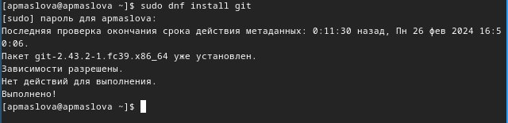{#fig:001 width=70%}

Установим gh (рис. [-@fig:002]).

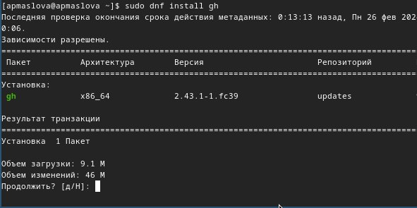{#fig:002 width=70%}

Проведём базовую настройку (рис. [-@fig:003]).

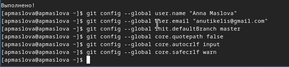{#fig:003 width=70%}

Сгенерируем ключ ssh по алгоритму rsa (рис. [-@fig:004]).

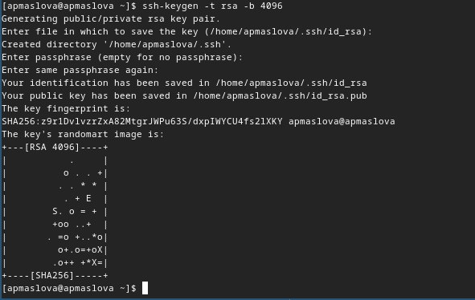{#fig:004 width=70%}

И затем создадим также ключ ssh по алгоритму ed (рис. [-@fig:005]).

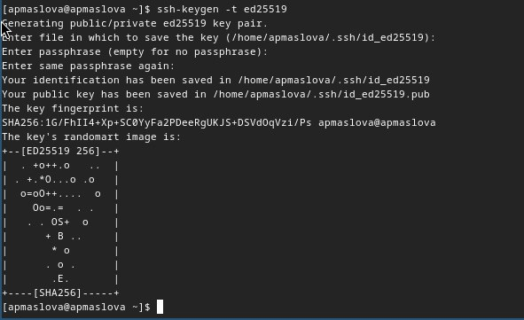{#fig:005 width=70%}

Затем создадим ключ pgp (рис. [-@fig:006]).

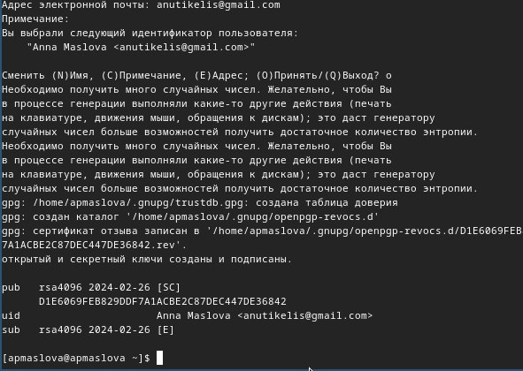{#fig:006 width=70%}

Добавим ключ на GitHub. Выведем список ключей и скопируем отпечаток (рис. [-@fig:007]).

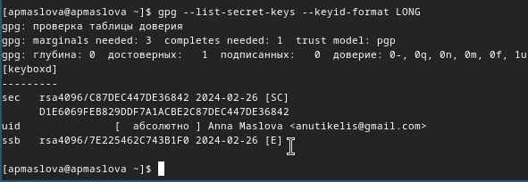{#fig:007 width=70%}

Далее нужно скопировать ключ. Для этого установим xclip (рис. [-@fig:008]).

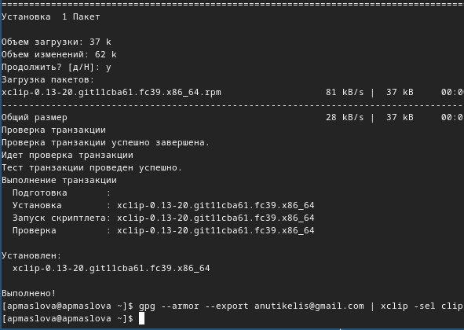{#fig:008 width=70%}

Скопировали и добавили ключ на GitHub. Настроим автоматические подписи коммитов (рис. [-@fig:009]).

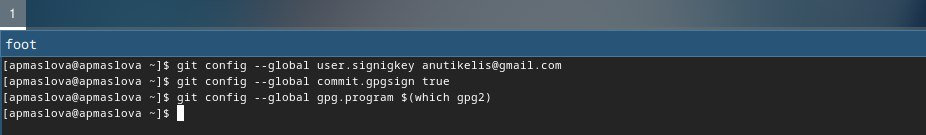{#fig:009 width=70%}

Проведём настройку gh (рис. [-@fig:010]).

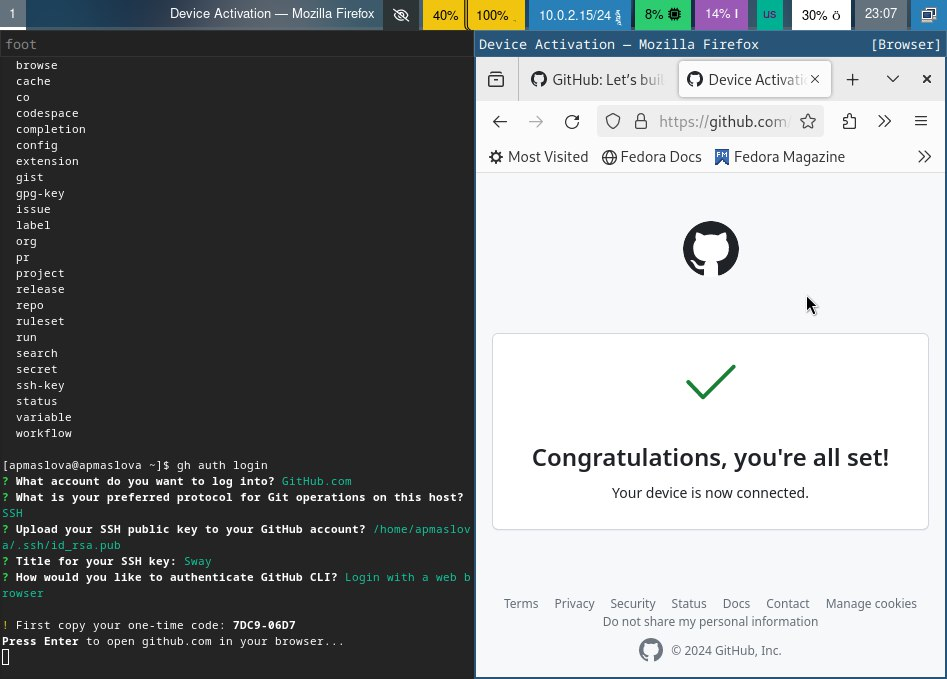{#fig:010 width=70%}

Как мы видим, настройка проведена успешно. Проверим наличие ключа на GitHub (рис. [-@fig:011]).

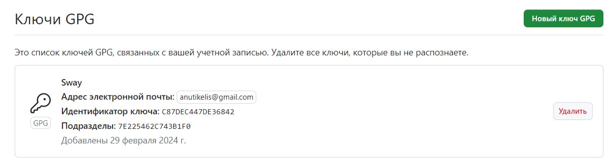{#fig:011 width=70%}

Ключ есть.
Теперь на основе шаблона создадим катлог курса (рис. [-@fig:012]).

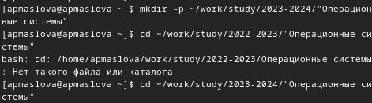{#fig:012 width=70%}

Создадим репозиторий (рис. [-@fig:013]).

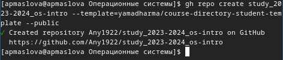{#fig:013 width=70%}

В папке `os-intro` клонируем репозиторий (рис. [-@fig:014]).

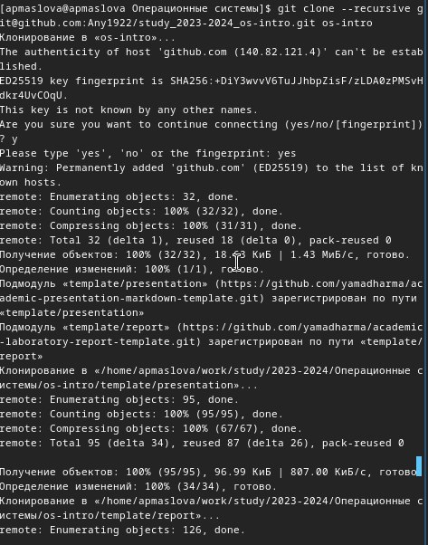{#fig:014 width=70%}

Удалим ненужные файлы (рис. [-@fig:015]).

{#fig:015 width=70%}

Создадим необходимые каталоги курса (рис. [-@fig:016]).

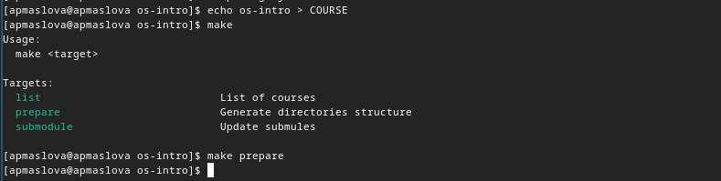{#fig:016 width=70%}

Отправим файлы на сервер GitHub (рис. [-@fig:017]).

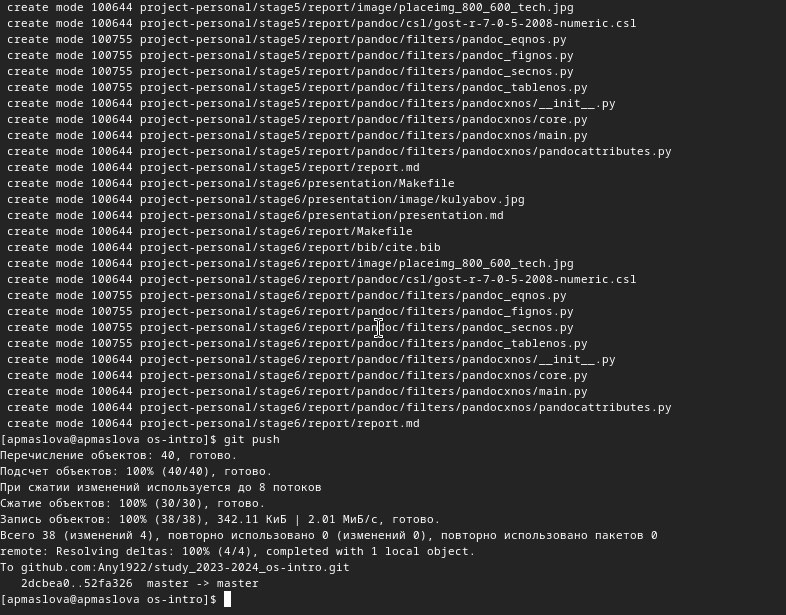{#fig:017 width=70%}

Проверим корректность репозитория на странице GitHub (рис. [-@fig:018]).

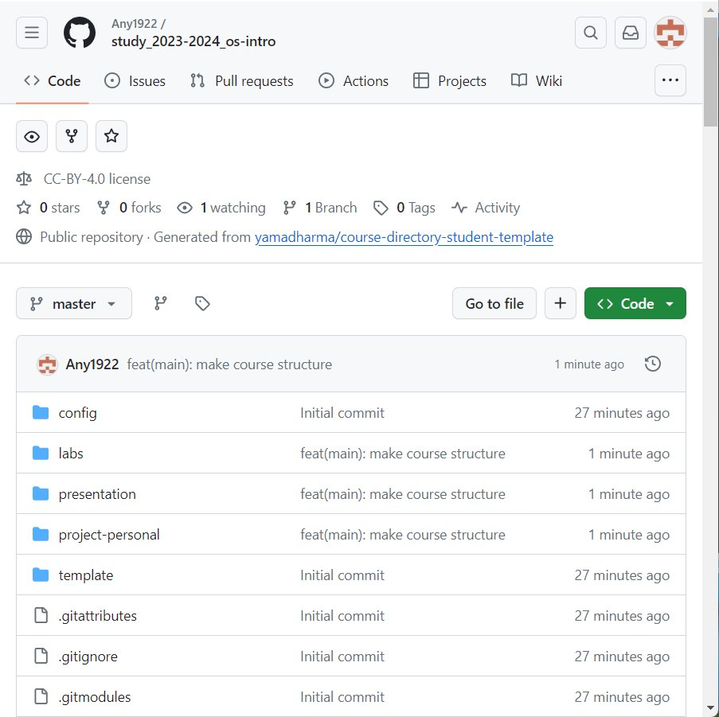{#fig:018 width=70%}

Как мы видим, репозиторий создан верно.

# Выводы

Мы изучили идеологию и применение средств контроля версий и освоили умение по работе с git.

# Список литературы{.unnumbered}

1. Dash, P. Getting Started with Oracle VM VirtualBox / P. Dash. – Packt Publishing Ltd, 2013. – 86 сс.
2. Colvin, H. VirtualBox: An Ultimate Guide Book on Virtualization with VirtualBox. VirtualBox / H. Colvin. – CreateSpace Independent Publishing Platform, 2015. – 70 сс.
3. Vugt, S. van. Red Hat RHCSA/RHCE 7 cert guide : Red Hat Enterprise Linux 7 (EX200 and EX300) : Certification Guide. Red Hat RHCSA/RHCE 7 cert guide / S. van Vugt. – Pearson IT Certification, 2016. – 1008 сс.
4. Робачевский, А. Операционная система UNIX / А. Робачевский, С. Немнюгин, О. Стесик. – 2-е изд. – Санкт-Петербург : БХВ-Петербург, 2010. – 656 сс.
5. Немет, Э. Unix и Linux: руководство системного администратора. Unix и Linux / Э. Немет, Г. Снайдер, Т.Р. Хейн, Б. Уэйли. – 4-е изд. – Вильямс, 2014. – 1312 сс.
6. Колисниченко, Д.Н. Самоучитель системного администратора Linux : Системный администратор / Д.Н. Колисниченко. – Санкт-Петербург : БХВ-Петербург, 2011. – 544 сс.
7. Robbins, A. Bash Pocket Reference / A. Robbins. – O’Reilly Media, 2016. – 156 сс.
