---
## Front matter
lang: ru-RU
title: Презентация по лабораторной работе №4
subtitle: 
author:
  - Маслова А.П.
institute:
  - Российский университет дружбы народов, Москва, Россия
date: 10 марта 2024

## i18n babel
babel-lang: russian
babel-otherlangs: english

## Formatting pdf
toc: false
toc-title: Содержание
slide_level: 2
aspectratio: 169
section-titles: true
theme: metropolis
header-includes:
 - \metroset{progressbar=frametitle,sectionpage=progressbar,numbering=fraction}
 - '\makeatletter'
 - '\beamer@ignorenonframefalse'
 - '\makeatother'
## Fonts
mainfont: PT Serif
romanfont: PT Serif
sansfont: PT Sans
monofont: PT Mono
mainfontoptions: Ligatures=TeX
romanfontoptions: Ligatures=TeX
sansfontoptions: Ligatures=TeX,Scale=MatchLowercase
monofontoptions: Scale=MatchLowercase,Scale=0.9
---

# Информация

## Докладчик

:::::::::::::: {.columns align=center}
::: {.column width="70%"}

  * Маслова Анна Павловна
  * студентка, НПИбд-02-23
  * факультет физико-математических и естественных наук, направление прикладная информатиика
  * Российский университет дружбы народов
  * [1132236134@pfur.ru](mailto:1132236134@pfur.ru)
  
:::
::: {.column width="30%"}
:::
::::::::::::::

## Цели работы

- Ознакомиться с настройкой `dotfiles` 
- Научиться использовать менеджер паролей `pass`
- Ознакомиться с `chezmoi`
- Научиться углубленной работе с `git`

# Выполнение лабораторной работы

## Установка pass и gopass

Для начала установим менеджер паролей `pass` и `gopass`

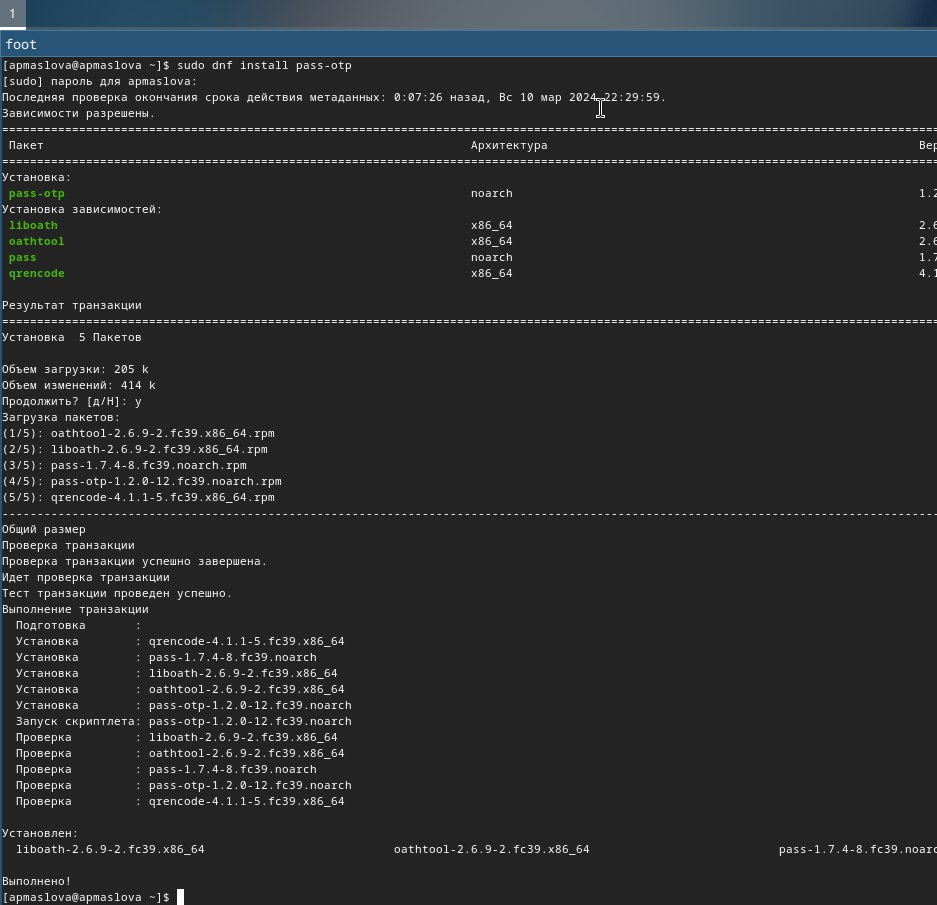{.column width="30%"}

## Установка pass и gopass

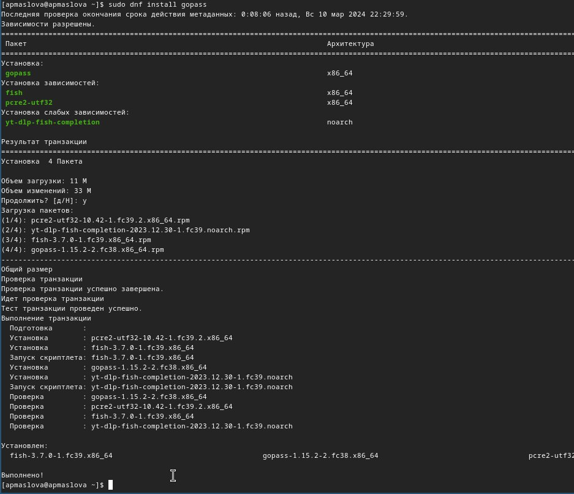{.column width="30%"}

## Настройка

Просмотрим список ключей, инициализируем хранилище и синхронизируем с `git`

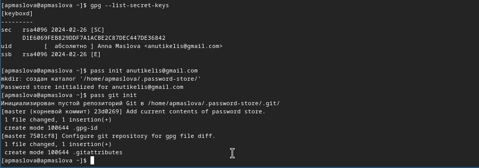{.column width="30%"}

## Синхронизация репозитория на хостинге

Зададим адрес репозитория на хостинге

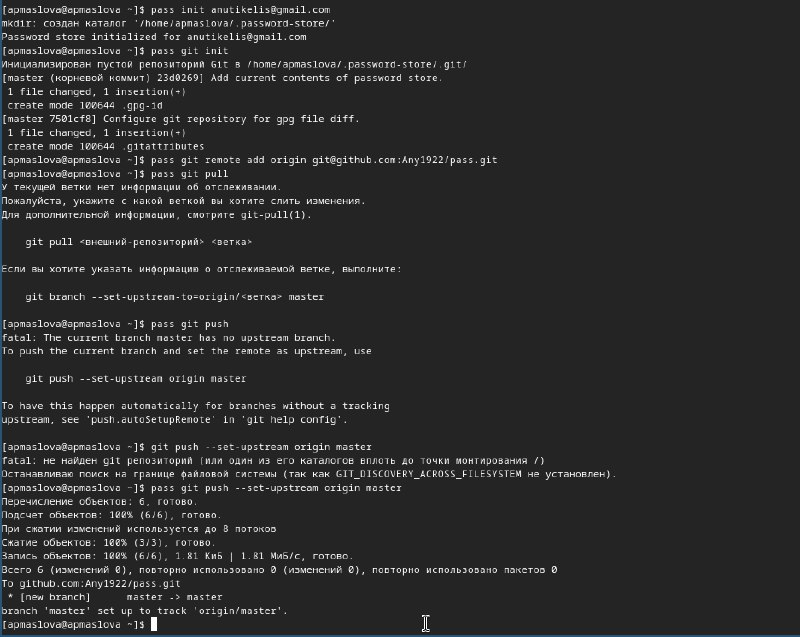{.column width="30%"}

## Коммит изменений

Закоммитим изменения

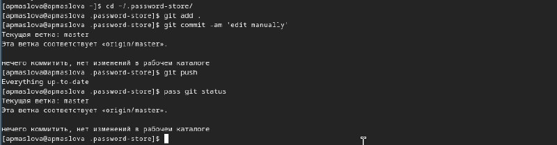{.column width="30%"}

Проверили статус синхронизации.

## Настройка интерфейса с браузером

Настроим интерфейс с браузером

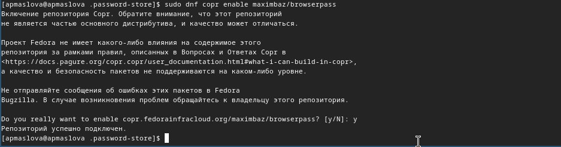{.column width="30%"}

## Настройка интерфейса с браузером

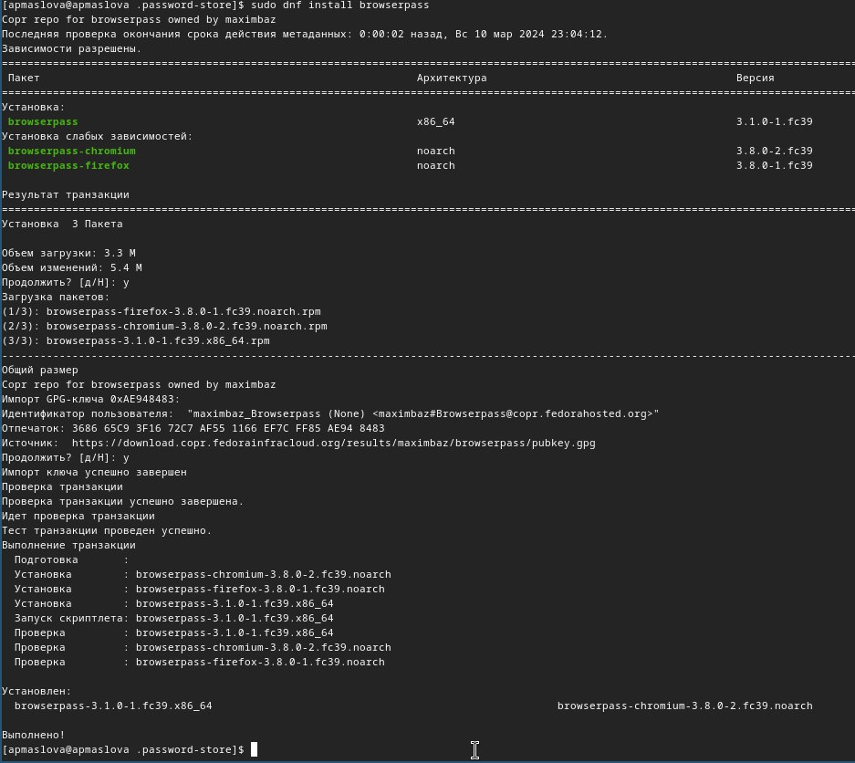{.column width="30%"}

## Добавление пароля

Добавим новый пароль, отобразим и изменим его

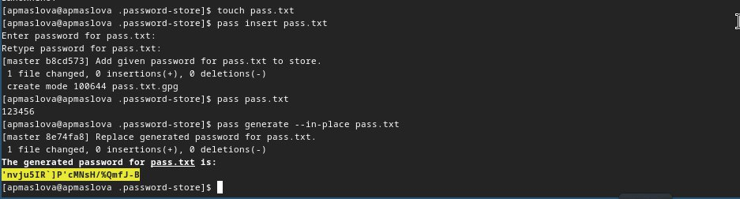{.column width="30%"}

## Установка дополнительного ПО

Далее для управления файлами конфигурации установим дополнительное программное обеспечение

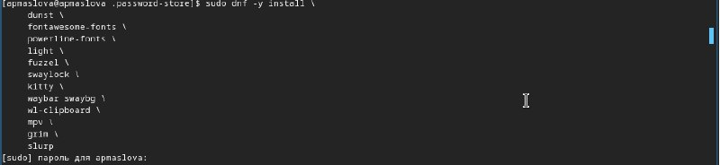{.column width="30%"}

## Установка шрифтов

Установим шрифты

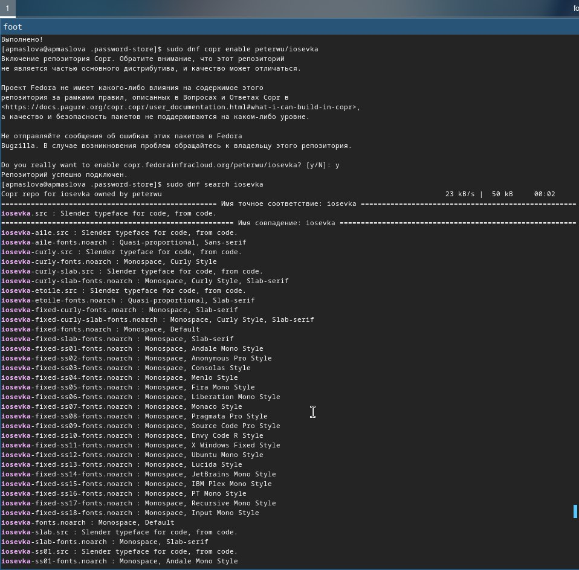{.column width="30%"}

## Установка шрифтов

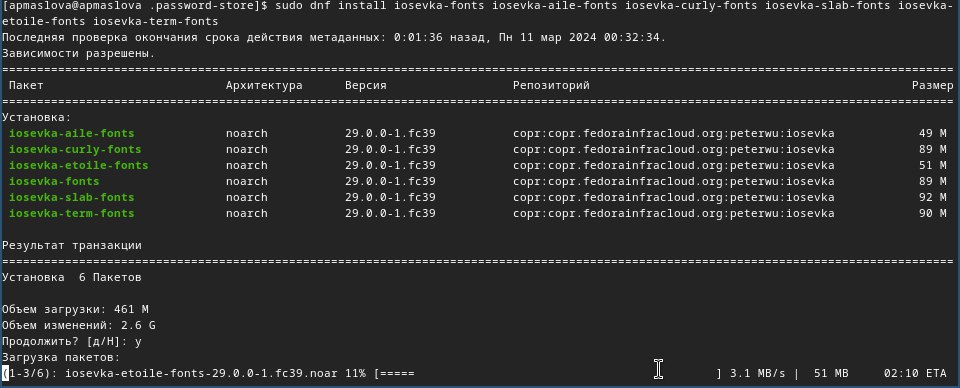{.column width="30%"}

## Установка бинарного файла

Установим бинарный файл

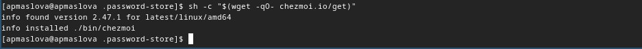{.column width="30%"}

## Подключение репозитория

Создадим репозиторий и подключим его к своей системе

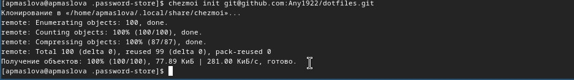{.column width="30%"}

## Запуск chezmoi diff

Запустим `chezmoi diff` и проверим, какие изменения внесёт `chezmooi` в домашний каталог

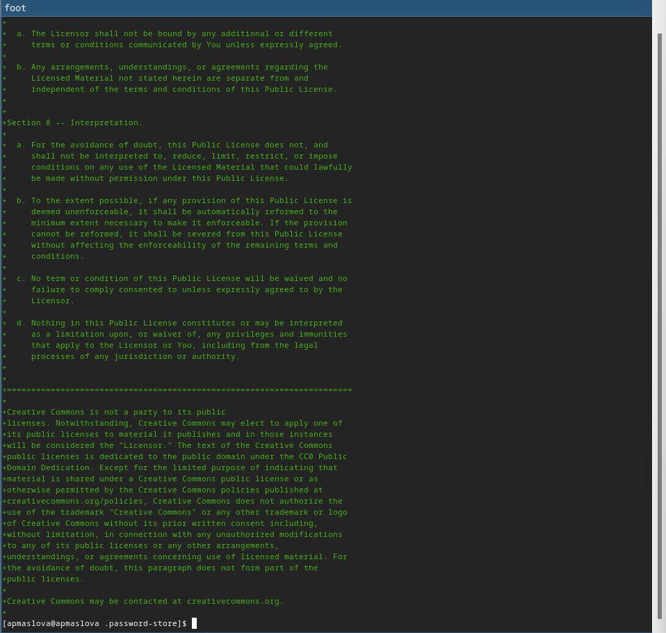{.column width="30%"}

Изменения нас устраивают, поэтому следующей командой будет `chezmoi apply -v`.

## Другая виртуальная машина

Для проверки работы `chezmoi` на разных машинах запустим виртуальную машину, созданную при прохождении курса "Архитектура компьютера", и инициализируем на неё `chezmoi` с нашим репозиторием `dotfiles`

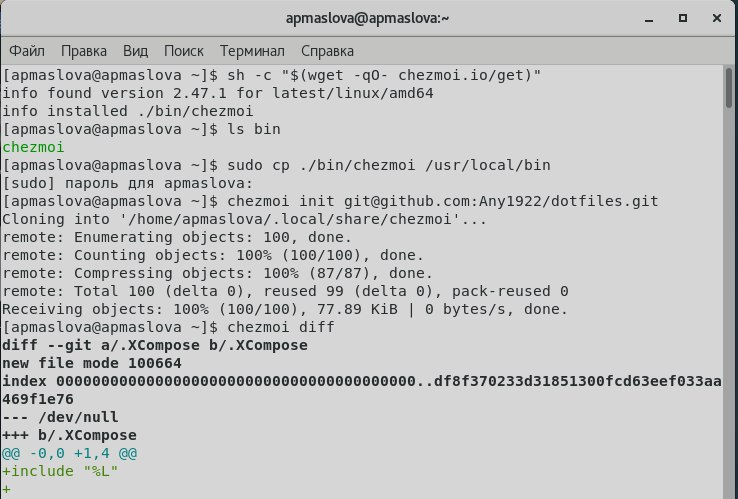{.column width="30%"}

Проверили внесённые изменения, и они нас устраивают.

## Установка ditfiles а новую машину

Установим наши `dotfiles` на эту машину 

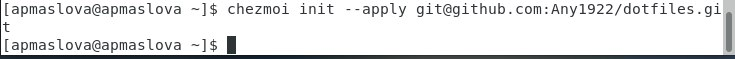{.column width="30%"}

## Извлечение изменений

Извлечём изменения из репозитория

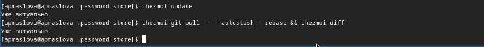{.column width="30%"}

## Автоматическая фиксация и отправка изменений

Настроим автоматическую отправку изменений в репозиторий

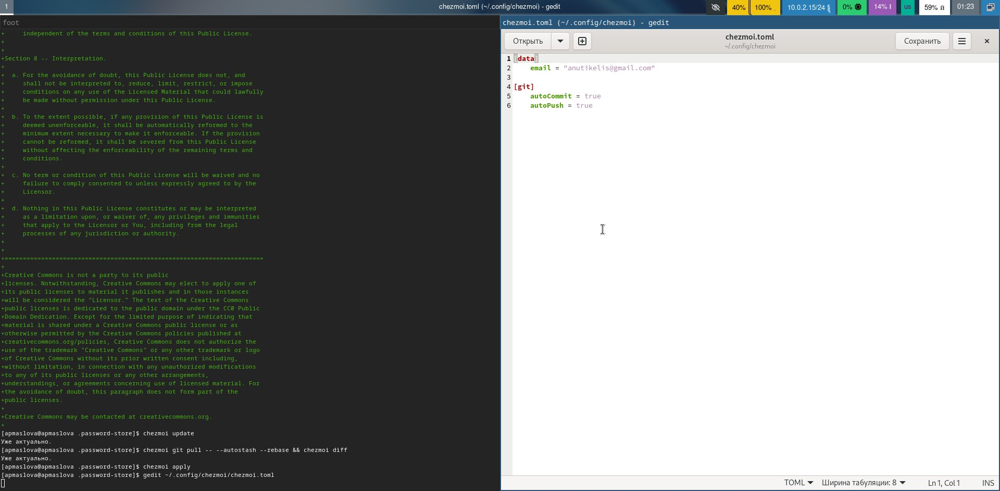{.column width="30%"}

# Выводы

Мы ознакомились с настройкой `dotfiles` и научились использовать менеджер паролей `pass`. Ознакомились с `chezmoi`. Научились углубленной работе с `git`.

