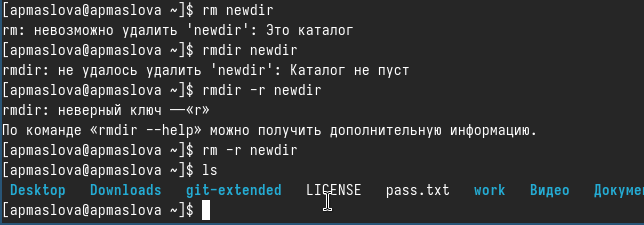

---
## Front matter
lang: ru-RU
title: Презентация по лабораторной работе №6
subtitle: 
author:
  - Маслова А.П.
institute:
  - Российский университет дружбы народов, Москва, Россия
date: 14 марта 2024

## i18n babel
babel-lang: russian
babel-otherlangs: english

## Formatting pdf
toc: false
toc-title: Содержание
slide_level: 2
aspectratio: 169
section-titles: true
theme: metropolis
header-includes:
 - \metroset{progressbar=frametitle,sectionpage=progressbar,numbering=fraction}
 - '\makeatletter'
 - '\beamer@ignorenonframefalse'
 - '\makeatother'
## Fonts
mainfont: PT Serif
romanfont: PT Serif
sansfont: PT Sans
monofont: PT Mono
mainfontoptions: Ligatures=TeX
romanfontoptions: Ligatures=TeX
sansfontoptions: Ligatures=TeX,Scale=MatchLowercase
monofontoptions: Scale=MatchLowercase,Scale=0.9
---

# Информация

## Докладчик

:::::::::::::: {.columns align=center}
::: {.column width="70%"}

  * Маслова Анна Павловна
  * студентка, НПИбд-02-23
  * факультет физико-математических и естественных наук, направление прикладная информатиика
  * Российский университет дружбы народов
  * [1132236134@pfur.ru](mailto:1132236134@pfur.ru)
  
:::
::: {.column width="30%"}
:::
::::::::::::::

## Цели работы

Приобретение практических навыков взаимодействия пользователя с системой посредством командной строки.

# Выполнение лабораторной работы

## Полное имя домашнего каталога

Определим полное имя нашего домашнего каталога. Далее относительно этого каталога будем выполнять последующие упражнения.

{.column width="70%"}

## Содержимое каталога /tmp

Выведем на экран содержимое каталога `/tmp`. Для этого используем команду `ls`с различными опциями. Используем опции `-a` и `-l`:

{.column width="30%"}

## Содержимое каталога /tmp

Опция `-a` выводит список содержимого вместе со скрытыми файлами. А опция `-l` позволяет увидеть подробную информацию о содержимом. При этом о каждом файле и каталоге будет выведена следующая информация:

- тип файла,
- право доступа,
- число ссылок,
- владелец,
- размер,
- дата последней ревизии,
- имя файла или каталога.

## Содержимое каталога /tmp

Далее используем опцию ` -alF`:

{.column width="30%"}

Эта опция позволяет увидеть такую же подробную информацию о всех файлах, включая скрытые.

## Содержимое /var/spool

Определим, есть ли в каталоге `/var/spool` подкаталог с именем `cron`.

{.column width="70%"}

## Содержимое домашней директории

Перейдём в наш домашний каталог и выведем на экран его содержимое.

{.column width="50%"}

Для того, чтобы узнать, кому принадлежат файлы, использовали опцию `-l`. Видим, что файлы принадлежат пользователю `apmaslova` (мне).

## Создание и удаление каталогов

В домашнем каталоге создадим новый каталог с именем `newdir`. Затем в каталоге `~/newdir` создадим новый каталог с именем `morefun`. Далее в домашнем каталоге создадим одной командой три новых каталога с именами `letters, memos, misk` и удалим эти каталоги одной командой.

{.column width="50%"}

## Удаление ~/newdir/morefun

Попробуем удалить ранее созданный каталог `~/newdir` командой `rm`. Проверим, был ли каталог удалён. Затем после неудачной попытки удалим каталог `~/newdir/morefun` из домашнего каталога с помощью опции `-r`. Проверим корректность выполнения команды.

{.column width="50%"}

Как мы видим, опция `-r` позволяет удалять каталоги вместе со всем их содержимым.

## Команда man для ls

С помощью команды `man` определим, какую опцию команды `ls` нужно использовать для просмотра содержимого не только указанного каталога, но и подкаталогов, входящих в него. Определим также набор опций команды `ls`, позволяющий отсортировать по времени последнего изменения выводимый список содержимого каталога с развёрнутым описанием файлов.

{.column width="30%"}

Узнали, что для для просмотра содержимого всех подкаталогов, входящих в каталог, требуется опция `-R`. 

## Команда man для различных команд

А набор опций команды `ls`, позволяющий отсортировать по времени последнего изменения выводимый список содержимого каталога с развёрнутым описанием файлов таков: `ls -t -l`.

Используем команду man для просмотра описания следующих команд: `cd, pwd, mkdir, rmdir, rm`.

## Команда man для cd

{.column width="80%"}

## Команда man для pwd

{.column width="80%"}

## Команда man для mkdir

{.column width="80%"}

## Команда man для rmdir

{.column width="80%"}

## Команда man для rm

{.column width="80%"}

## Команда history

Используя информацию, полученную при помощи команды `history`, выполним модификацию и исполнение нескольких команд из буфера команд

{.column width="70%"}

## Модификация команды ls

{.column width="30%"}

## Модификация команд mkdir и rmdir

{.column width="80%"}

# Выводы

Мы ознакомились с настройкой `dotfiles` и научились использовать менеджер паролей `pass`. Ознакомились с `chezmoi`. Научились углубленной работе с `git`.

