---
## Front matter
title: "Отчёт по лабораторной работе №6"
subtitle: "дисциплина: Операционные системы"
author: "Маслова Анна Павловна"

## Generic otions
lang: ru-RU
toc-title: "Содержание"

## Bibliography
bibliography: bib/cite.bib
csl: pandoc/csl/gost-r-7-0-5-2008-numeric.csl

## Pdf output format
toc: true # Table of contents
toc-depth: 2
lof: true # List of figures
lot: true # List of tables
fontsize: 12pt
linestretch: 1.5
papersize: a4
documentclass: scrreprt
## I18n polyglossia
polyglossia-lang:
  name: russian
  options:
	- spelling=modern
	- babelshorthands=true
polyglossia-otherlangs:
  name: english
## I18n babel
babel-lang: russian
babel-otherlangs: english
## Fonts
mainfont: PT Serif
romanfont: PT Serif
sansfont: PT Sans
monofont: PT Mono
mainfontoptions: Ligatures=TeX
romanfontoptions: Ligatures=TeX
sansfontoptions: Ligatures=TeX,Scale=MatchLowercase
monofontoptions: Scale=MatchLowercase,Scale=0.9
## Biblatex
biblatex: true
biblio-style: "gost-numeric"
biblatexoptions:
  - parentracker=true
  - backend=biber
  - hyperref=auto
  - language=auto
  - autolang=other*
  - citestyle=gost-numeric
## Pandoc-crossref LaTeX customization
figureTitle: "Рис."
tableTitle: "Таблица"
listingTitle: "Листинг"
lofTitle: "Список иллюстраций"
lotTitle: "Список таблиц"
lolTitle: "Листинги"
## Misc options
indent: true
header-includes:
  - \usepackage{indentfirst}
  - \usepackage{float} # keep figures where there are in the text
  - \floatplacement{figure}{H} # keep figures where there are in the text
---

# Цель работы

Приобретение практических навыков взаимодействия пользователя с системой посредством командной строки.

# Выполнение лабораторной работы

Определим полное имя нашего домашнего каталога. Далее относительно этого каталога будем выполнять последующие упражнения (рис. [-@fig:001]).

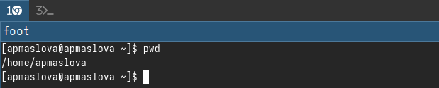{#fig:001 width=70%}

Выведем на экран содержимое каталога `/tmp`. Для этого используем команду `ls`с различными опциями. Используем опции `-a` и `-l`: (рис. [-@fig:002])

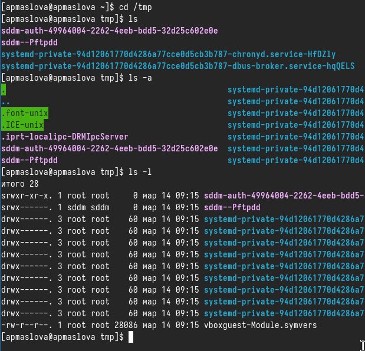{#fig:002 width=70%}

Опция `-a` выводит список содержимого вместе со скрытыми файлами. А опция `-l` позволяет увидеть подробную информацию о содержимом. При этом о каждом файле и каталоге будет выведена следующая информация:
- тип файла,
- право доступа,
- число ссылок,
- владелец,
- размер,
- дата последней ревизии,
- имя файла или каталога.

Далее используем опцию ` -alF` (рис. [-@fig:003]):

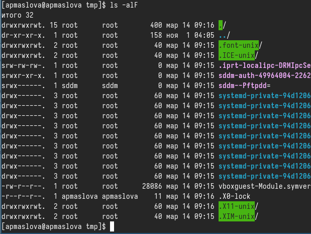{#fig:003 width=70%}

Эта опция позволяет увидеть такую же подробную информацию о всех файлах, включая скрытые.

Определим, есть ли в каталоге `/var/spool` подкаталог с именем `cron` (рис. [-@fig:004]).

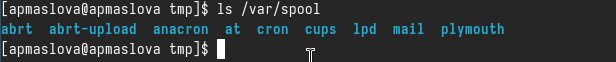{#fig:004 width=70%}

Перейдём в наш домашний каталог и выведем на экран его содержимое (рис. [-@fig:005]).

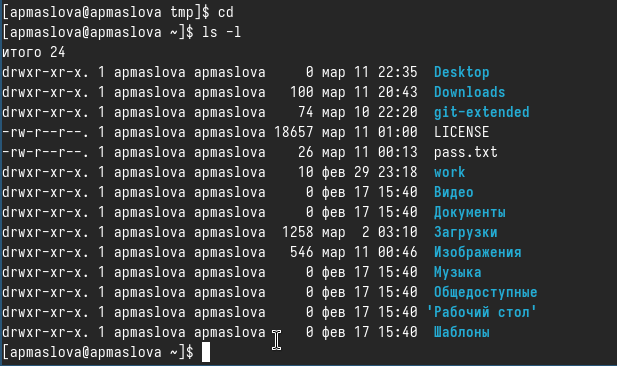{#fig:005 width=70%}

Для того, чтобы узнать, кому принадлежат файлы, использовали опцию `-l`. Видим, что файлы принадлежат пользователю `apmaslova` (мне).

В домашнем каталоге создадим новый каталог с именем `newdir`. Затем в каталоге `~/newdir` создадим новый каталог с именем `morefun`. Далее в домашнем каталоге создадим одной командой три новых каталога с именами `letters, memos, misk` и удалим эти каталоги одной командой (рис. [-@fig:006]).

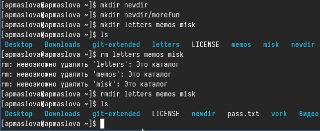{#fig:006 width=70%}

Попробуем удалить ранее созданный каталог `~/newdir` командой `rm`. Проверим, был ли каталог удалён. Затем после неудачной попытки удалим каталог `~/newdir/morefun` из домашнего каталога с помощью опции `-r`. Проверим корректность выполнения команды (рис. [-@fig:007]).

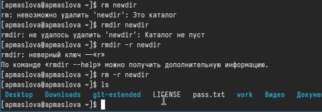{#fig:007 width=70%}

Как мы видим, опция `-r` позволяет удалять каталоги вместе со всем их содержимым.

С помощью команды `man` определим, какую опцию команды `ls` нужно использовать для просмотра содержимого не только указанного каталога, но и подкаталогов, входящих в него. Определим также набор опций команды `ls`, позволяющий отсортировать по времени последнего изменения выводимый список содержимого каталога с развёрнутым описанием файлов. (рис. [-@fig:008]).

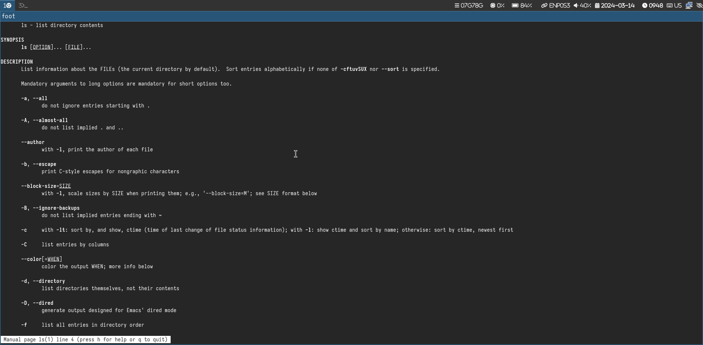{#fig:008 width=70%}

Узнали, что для для просмотра содержимого всех подкаталогов, входящих в каталог, требуется опция `-R`. А набор опций команды `ls`, позволяющий отсортировать по времени последнего изменения выводимый список содержимого каталога с развёрнутым описанием файлов таков: `ls -t -l`.

Используем команду man для просмотра описания следующих команд: `cd, pwd, mkdir, rmdir, rm` (рис. [-@fig:009], [-@fig:010], [-@fig:011], [-@fig:012], [-@fig:013]).

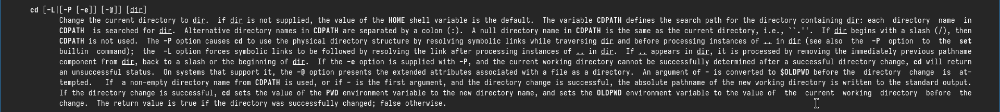{#fig:009 width=70%}

{#fig:010 width=70%}

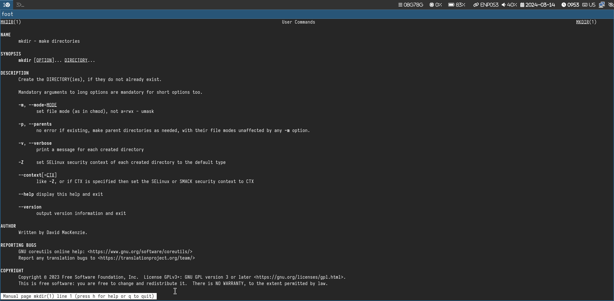{#fig:011 width=70%}

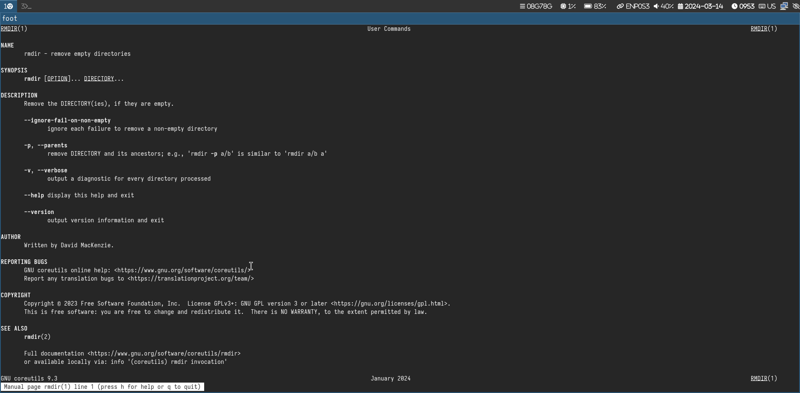{#fig:012 width=70%}

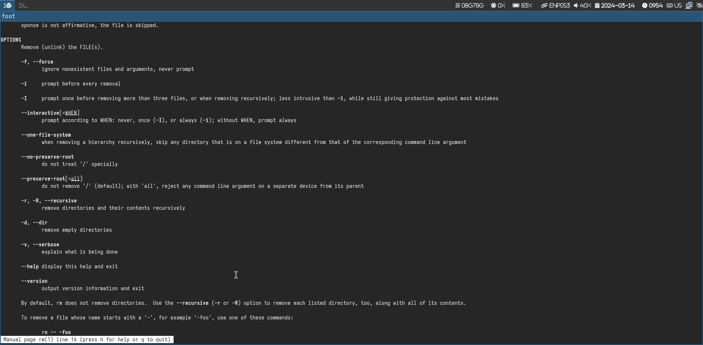{#fig:013 width=70%}

Используя информацию, полученную при помощи команды `history`, выполним модификацию и исполнение нескольких команд из буфера команд (рис. [-@fig:014], [-@fig:015], [-@fig:016]).

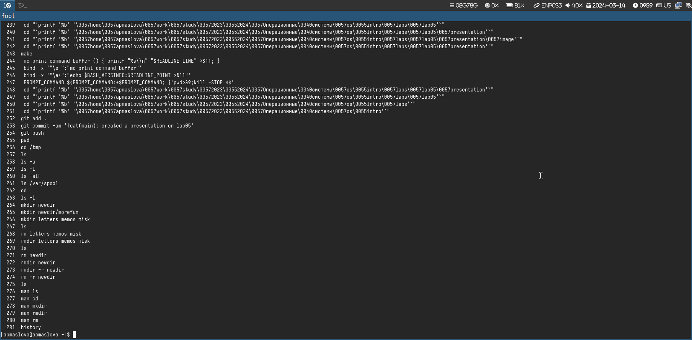{#fig:014 width=70%}

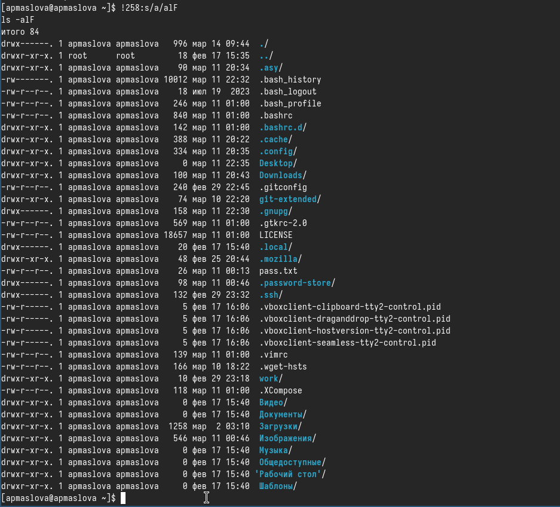{#fig:015 width=70%}

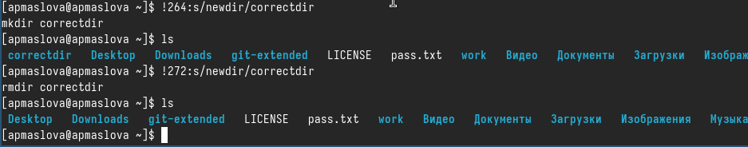{#fig:016 width=70%}

# Ответы на контрольные вопросы

1. Командная строка - это интерфейс, который позволяет пользователю взаимодействовать с операционной системой, вводя текстовые команды.
2. Для определения абсолютного пути текущего каталога используется команда `pwd`. Например, при вводе команды `pwd` будет выведен абсолютный путь текущего каталога.
3. Для определения только типов файлов и их имен в текущем каталоге можно использовать команду `ls` с опцией `-l`. Например, `ls -l`.
4. Для отображения информации о скрытых файлах необходимо использовать опцию `-a` с командой `ls`. Например, `ls -a`.
5. Для удаления файла используется команда `rm`, а для удаления каталога - команда `rm -r`. Нельзя удалить файл и каталог одной и той же командой. Например, `rm file.txt` для удаления файла и `rm -r directory` для удаления каталога.
6. Для вывода информации о последних выполненных командах можно воспользоваться командой `history`.
7. Для модифицированного выполнения команды из истории используется восклицательный знак. Например, `!10` выполнит 10-ю команду из истории.
8. Пример запуска нескольких команд в одной строке: `mkdir newfolder;cd newfolder` - создание нового каталога и переход в него.
9. Символы экранирования `(\)` используются для обозначения специального значения символа. Например, символ `\$` экранирует долларовый знак.
10. При выполнении команды `ls` с опцией `l` выводится более детальная информация о файлах, такая как права доступа, владелец, размер и дата изменения.
11. Относительный путь к файлу указывает на его местоположение относительно текущего каталога, абсолютный путь указывает полный путь от корневого каталога. Например, `cat file.txt` и `cat /home/user/file.txt`.
12. Для получения информации о команде можно воспользоваться командой `man`, например `man ls` для получения справки о команде `ls`.
13. Для автоматического дополнения вводимых команд используется клавиша Tab.

# Выводы

Научились взаимодействовать с системой посредством командной строки.

# Список литературы{.unnumbered}

1. Dash, P. Getting Started with Oracle VM VirtualBox / P. Dash. – Packt Publishing Ltd, 2013. – 86 сс.
2. Colvin, H. VirtualBox: An Ultimate Guide Book on Virtualization with VirtualBox. VirtualBox / H. Colvin. – CreateSpace Independent Publishing Platform, 2015. – 70 сс.
3. Vugt, S. van. Red Hat RHCSA/RHCE 7 cert guide : Red Hat Enterprise Linux 7 (EX200 and EX300) : Certification Guide. Red Hat RHCSA/RHCE 7 cert guide / S. van Vugt. – Pearson IT Certification, 2016. – 1008 сс.
4. Робачевский, А. Операционная система UNIX / А. Робачевский, С. Немнюгин, О. Стесик. – 2-е изд. – Санкт-Петербург : БХВ-Петербург, 2010. – 656 сс.
5. Немет, Э. Unix и Linux: руководство системного администратора. Unix и Linux / Э. Немет, Г. Снайдер, Т.Р. Хейн, Б. Уэйли. – 4-е изд. – Вильямс, 2014. – 1312 сс.
6. Колисниченко, Д.Н. Самоучитель системного администратора Linux : Системный администратор / Д.Н. Колисниченко. – Санкт-Петербург : БХВ-Петербург, 2011. – 544 сс.
7. Robbins, A. Bash Pocket Reference / A. Robbins. – O’Reilly Media, 2016. – 156 сс.
