---
## Front matter
lang: ru-RU
title: Презентация по лабораторной работе №7
subtitle: 
author:
  - Маслова А.П.
institute:
  - Российский университет дружбы народов, Москва, Россия
date: 10 марта 2024

## i18n babel
babel-lang: russian
babel-otherlangs: english

## Formatting pdf
toc: false
toc-title: Содержание
slide_level: 2
aspectratio: 169
section-titles: true
theme: metropolis
header-includes:
 - \metroset{progressbar=frametitle,sectionpage=progressbar,numbering=fraction}
 - '\makeatletter'
 - '\beamer@ignorenonframefalse'
 - '\makeatother'
## Fonts
mainfont: PT Serif
romanfont: PT Serif
sansfont: PT Sans
monofont: PT Mono
mainfontoptions: Ligatures=TeX
romanfontoptions: Ligatures=TeX
sansfontoptions: Ligatures=TeX,Scale=MatchLowercase
monofontoptions: Scale=MatchLowercase,Scale=0.9
---

# Информация

## Докладчик

:::::::::::::: {.columns align=center}
::: {.column width="70%"}

  * Маслова Анна Павловна
  * студентка, НПИбд-02-23
  * факультет физико-математических и естественных наук, направление прикладная информатиика
  * Российский университет дружбы народов
  * [1132236134@pfur.ru](mailto:1132236134@pfur.ru)
  
:::
::: {.column width="30%"}
:::
::::::::::::::


## Цели работы

Ознакомление с файловой системой Linux, её структурой, именами и содержанием каталогов. Приобретение практических навыков по применению команд для работы с файлами и каталогами, по управлению процессами (и работами), по проверке использования диска и обслуживанию файловой системы.

# Выполнение лабораторной работы

## Первая часть лр

Выполните все примеры, приведённые в первой части описания лабораторной работы

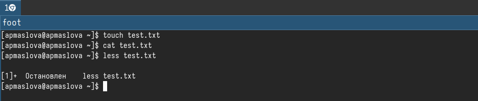{.column width="30%"}

## Файл equipment

Скопируйте файл `/usr/include/sys/io.h` в домашний каталог и назовите его `equipment`. Если файла `io.h` нет, то используйте любой другой файл в каталоге `/usr/include/sys/` вместо него.

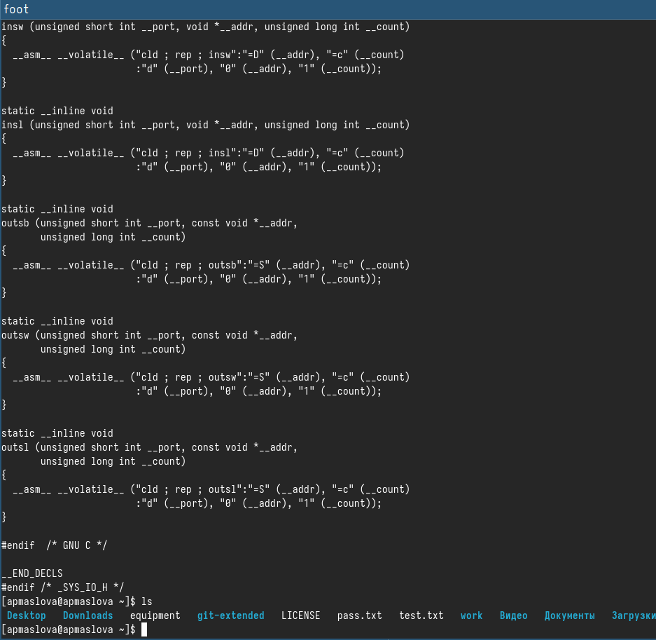{.column width="30%"}

## Создание директории ~/ski.plases

В домашнем каталоге создайте директорию `~/ski.plases`

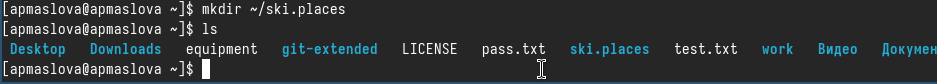{.column width="30%"}

## Перемещение файла equiment

Переместите файл equipment в каталог `~/ski.plases`

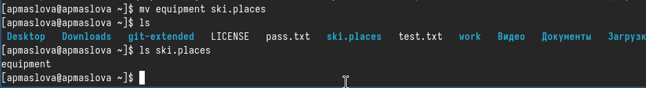{.column width="30%"}

## Переименование файла equipment

Переименуйте файл `~/ski.plases/equipment` в `~/ski.plases/equiplist`

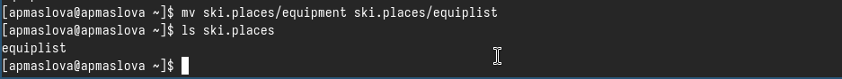{.column width="30%"}

## Создание abc1

Создайте в домашнем каталоге файл `abc1` и скопируйте его в каталог `~/ski.plases`, назовите его `equiplist2`.

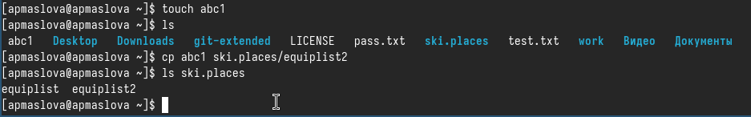{.column width="30%"}

## Создание каталога с именем equipment в каталоге ~/ski.plases.

Создайте каталог с именем `equipment` в каталоге `~/ski.plases`.

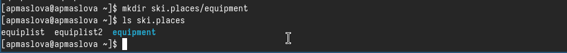{.column width="30%"}

## Перемещение файлов ~/ski.plases/equiplist и equiplist2 в каталог ~/ski.plases/equipment

Переместите файлы `~/ski.plases/equiplist` и `equiplist2` в каталог `~/ski.plases/equipment`.

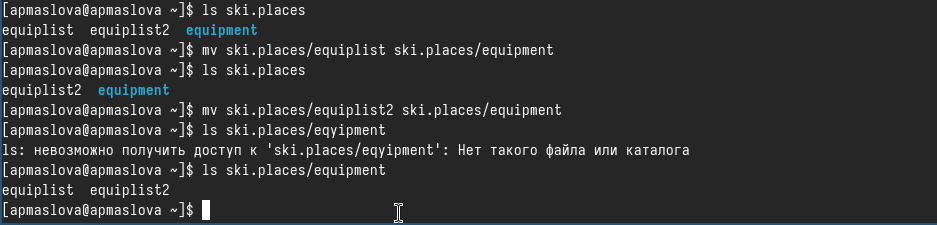{.column width="30%"}

## Создайте и переместите каталог ~/newdir в каталог ~/ski.plases

Создайте и переместите каталог `~/newdir` в каталог `~/ski.plases` и назовите его `plans`.

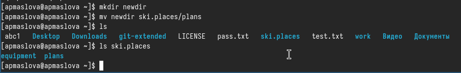{.column width="30%"}

## Определение прав доступа

Определите опции команды `chmod`, необходимые для того, чтобы присвоить перечисленным ниже файлам выделенные права доступа, считая, что в начале таких прав нет:
```
drwxr--r--  australia
drwx--x--x   play
-r-xr--r--   my_os
-rw-rw-r--   feathers
```
При необходимости создайте нужные файлы.

## Создание файлов

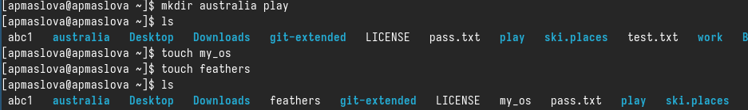{.column width="30%"}

## Определение прав доступа

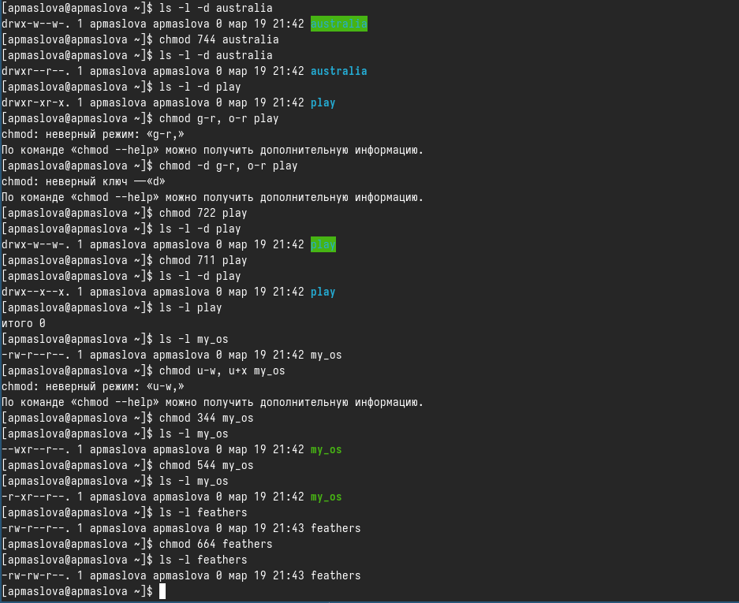{.column width="30%"}

## Просмотр содержимого password

Просмотрите содержимое файла `/etc/password`.

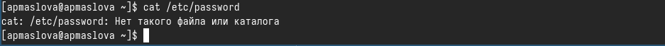{.column width="30%"}

## Скопируем файл ~/feathers в файл ~/file.old

Скопируйте файл `~/feathers` в файл `~/file.old`.

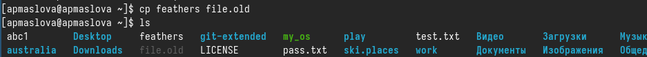{.column width="30%"}

## Переместим файл ~/file.old в каталог ~/play

Переместите файл `~/file.old` в каталог `~/play`.

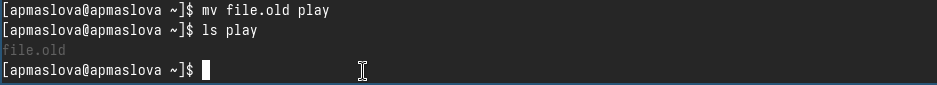{.column width="30%"}

## Скопируем каталог ~/play в каталог ~/fun

Скопируйте каталог `~/play` в каталог `~/fun`.

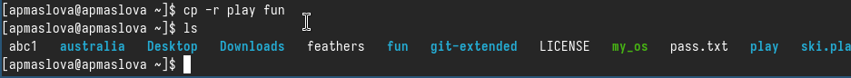{.column width="30%"}

## Перемещение каталога ~/fun в каталог ~/play

Переместите каталог `~/fun` в каталог `~/play` и назовите его `games`.

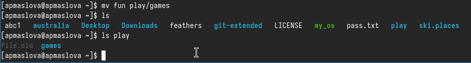{.column width="30%"}

## Лишение владельца файла ~/feathers права на чтение

Лишите владельца файла `~/feathers` права на чтение.

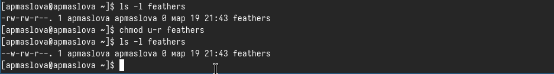{.column width="30%"}

## Команда cat и cp

Попытаемся просмотреть файл `~/feathers` командой `cat` и скопировать файл 

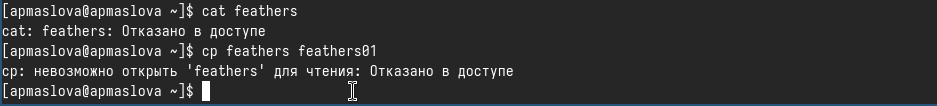{.column width="30%"}

## Дадим владельцу файла ~/feathers право на чтение

Дайте владельцу файла `~/feathers` право на чтение.

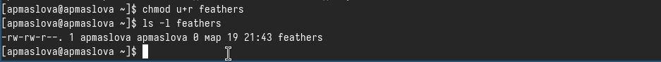{.column width="30%"}

## Лишение владельца каталога ~/play права на выполнение

Лишите владельца каталога `~/play` права на выполнение

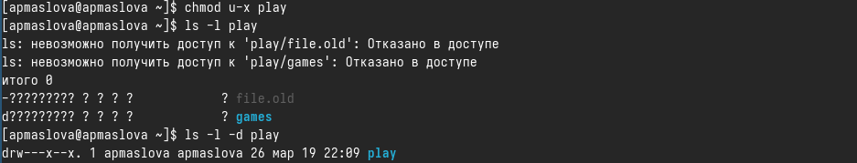{.column width="30%"}

## Переход в каталог ~/play

Перейдите в каталог `~/play`. Дайте владельцу каталога `~/play` право на выполнение.

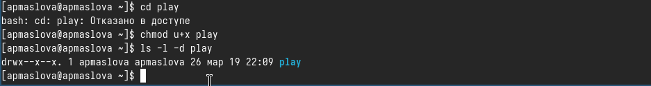{.column width="30%"}

## man mount

Прочитайте `man` по командам `mount`, `fsck`, `mkfs`, `kill`.

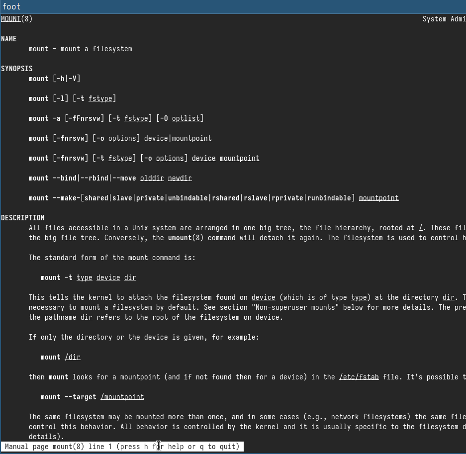{.column width="30%"}

## man fsck

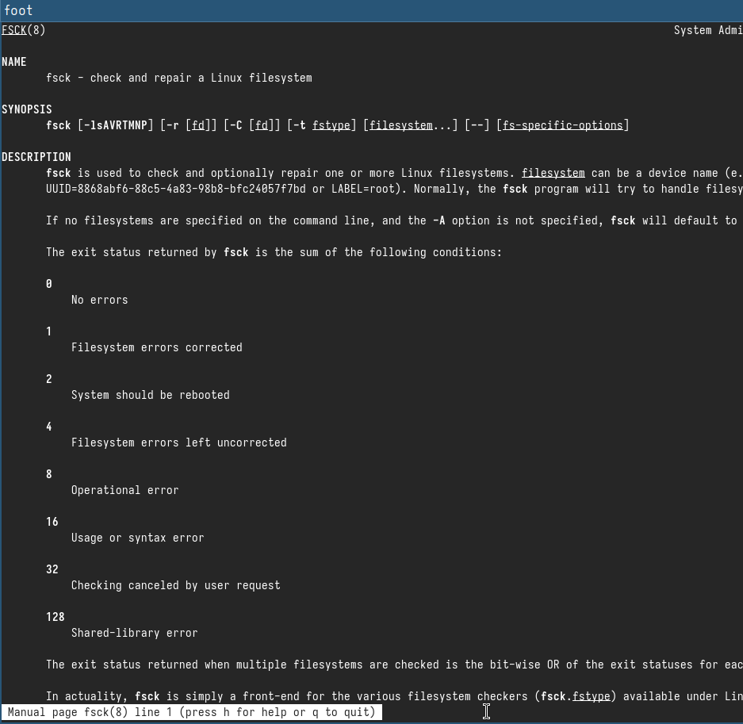{.column width="30%"}

## man mkfs

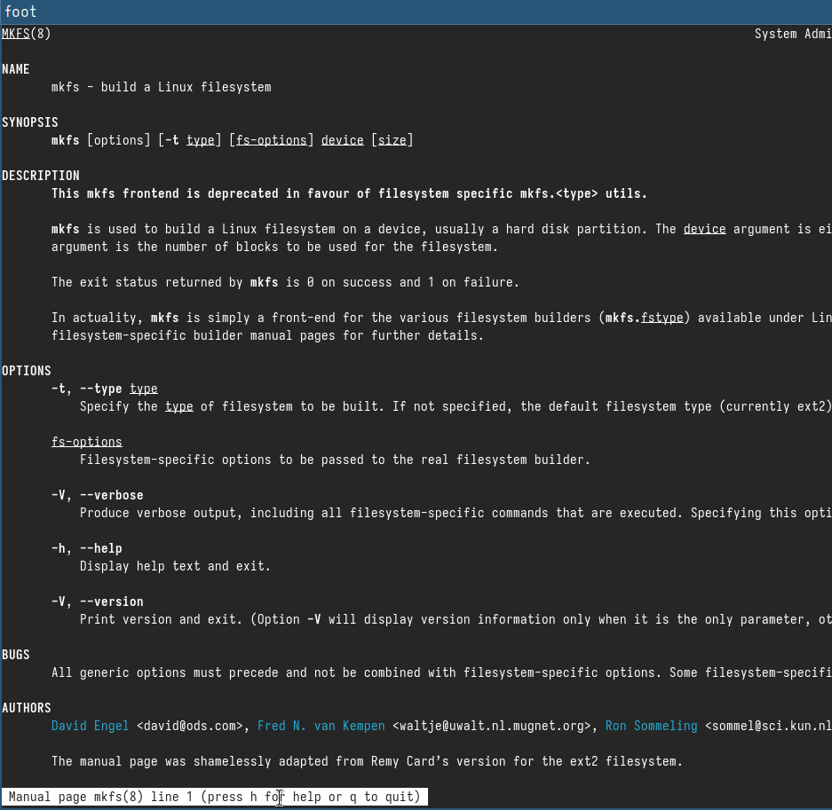{.column width="30%"}

## man kill

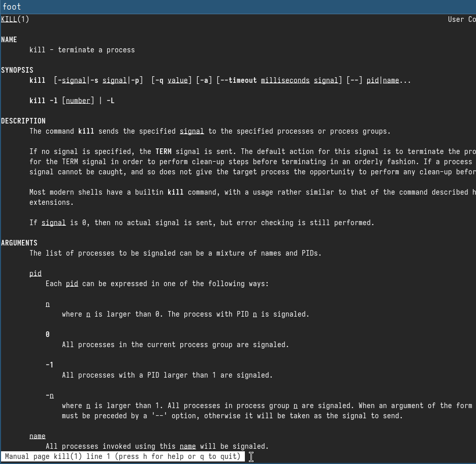{.column width="30%"}


# Выводы

Ознакомились с файловой системой Linux, её структурой, именами и содержанием каталогов. Приобрели практические навыки по применению команд для работы с файлами и каталогами, по управлению процессами (и работами), по проверке использования диска и обслуживанию файловой системы.


