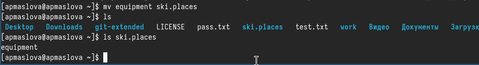

---
## Front matter
title: "Отчёт по лабораторной работе №7"
subtitle: "дисциплина: Операционные системы"
author: "Маслова Анна Павловна"

## Generic otions
lang: ru-RU
toc-title: "Содержание"

## Bibliography
bibliography: bib/cite.bib
csl: pandoc/csl/gost-r-7-0-5-2008-numeric.csl

## Pdf output format
toc: true # Table of contents
toc-depth: 2
lof: true # List of figures
lot: true # List of tables
fontsize: 12pt
linestretch: 1.5
papersize: a4
documentclass: scrreprt
## I18n polyglossia
polyglossia-lang:
  name: russian
  options:
	- spelling=modern
	- babelshorthands=true
polyglossia-otherlangs:
  name: english
## I18n babel
babel-lang: russian
babel-otherlangs: english
## Fonts
mainfont: PT Serif
romanfont: PT Serif
sansfont: PT Sans
monofont: PT Mono
mainfontoptions: Ligatures=TeX
romanfontoptions: Ligatures=TeX
sansfontoptions: Ligatures=TeX,Scale=MatchLowercase
monofontoptions: Scale=MatchLowercase,Scale=0.9
## Biblatex
biblatex: true
biblio-style: "gost-numeric"
biblatexoptions:
  - parentracker=true
  - backend=biber
  - hyperref=auto
  - language=auto
  - autolang=other*
  - citestyle=gost-numeric
## Pandoc-crossref LaTeX customization
figureTitle: "Рис."
tableTitle: "Таблица"
listingTitle: "Листинг"
lofTitle: "Список иллюстраций"
lotTitle: "Список таблиц"
lolTitle: "Листинги"
## Misc options
indent: true
header-includes:
  - \usepackage{indentfirst}
  - \usepackage{float} # keep figures where there are in the text
  - \floatplacement{figure}{H} # keep figures where there are in the text
---

# Цель работы

Ознакомление с файловой системой Linux, её структурой, именами и содержанием каталогов. Приобретение практических навыков по применению команд для работы с файлами и каталогами, по управлению процессами (и работами), по проверке использования диска и обслуживанию файловой системы.

# Выполнение лабораторной работы

Выполните все примеры, приведённые в первой части описания лабораторной работы (рис. [-@fig:001]).

{#fig:001 width=70%}

Скопируйте файл `/usr/include/sys/io.h` в домашний каталог и назовите его `equipment`. Если файла `io.h` нет, то используйте любой другой файл в каталоге `/usr/include/sys/` вместо него (рис. [-@fig:002]).

{#fig:002 width=70%}

В домашнем каталоге создайте директорию `~/ski.plases` (рис. [-@fig:003]).

{#fig:003 width=70%}

Переместите файл equipment в каталог `~/ski.plases` (рис. [-@fig:004]).

{#fig:004 width=70%}

Переименуйте файл `~/ski.plases/equipment` в `~/ski.plases/equiplist` (рис. [-@fig:005]).

{#fig:005 width=70%}

Создайте в домашнем каталоге файл `abc1` и скопируйте его в каталог `~/ski.plases`, назовите его `equiplist2`. (рис. [-@fig:006])

{#fig:006 width=70%}

Создайте каталог с именем `equipment` в каталоге `~/ski.plases`. (рис. [-@fig:007])

{#fig:007 width=70%}

Переместите файлы `~/ski.plases/equiplist` и `equiplist2` в каталог `~/ski.plases/equipment`. (рис. [-@fig:008])

{#fig:008 width=70%}

Создайте и переместите каталог `~/newdir` в каталог `~/ski.plases` и назовите его `plans`.(рис. [-@fig:009])

{#fig:009 width=70%}

Определите опции команды `chmod`, необходимые для того, чтобы присвоить перечисленным ниже файлам выделенные права доступа, считая, что в начале таких прав нет (рис. [-@fig:011]):
```
drwxr--r--  australia
drwx--x--x   play
-r-xr--r--   my_os
-rw-rw-r--   feathers
```
При необходимости создайте нужные файлы.(рис. [-@fig:010])

{#fig:010 width=70%}

{#fig:011 width=70%}

Просмотрите содержимое файла `/etc/password`. (рис. [-@fig:012])

{#fig:012 width=70%}

Скопируйте файл `~/feathers` в файл `~/file.old`. (рис. [-@fig:013])

{#fig:013 width=70%}

Переместите файл `~/file.old` в каталог `~/play`. (рис. [-@fig:014])

{#fig:014 width=70%}

Скопируйте каталог `~/play` в каталог `~/fun`. (рис. [-@fig:015])

{#fig:015 width=70%}

Переместите каталог `~/fun` в каталог `~/play` и назовите его `games`. (рис. [-@fig:016])

{#fig:016 width=70%}

Лишите владельца файла `~/feathers` права на чтение. (рис. [-@fig:017])

{#fig:017 width=70%}

Попытаемся просмотреть файл `~/feathers` командой `cat` и скопировать файл (рис. [-@fig:018])

{#fig:018 width=70%}

Дайте владельцу файла `~/feathers` право на чтение. (рис. [-@fig:019])

{#fig:019 width=70%}

Лишите владельца каталога `~/play` права на выполнение (рис. [-@fig:020])

{#fig:020 width=70%}

Перейдите в каталог `~/play`. Дайте владельцу каталога `~/play` право на выполнение. (рис. [-@fig:021])

{#fig:021 width=70%}

Прочитайте `man` по командам `mount`, `fsck`, `mkfs`, `kill`.(рис. [-@fig:022], [-@fig:023], [-@fig:024], [-@fig:025])

{#fig:022 width=70%}

{#fig:023 width=70%}

{#fig:024 width=70%}

{#fig:025 width=70%}

# Выводы

Ознакомились с файловой системой Linux, её структурой, именами и содержанием каталогов. Приобрели практические навыки по применению команд для работы с файлами и каталогами, по управлению процессами (и работами), по проверке использования диска и обслуживанию файловой системы.

# Ответы на контрольные вопросы

1. На жёстком диске компьютера, на котором я выполняла лабораторную работу, были следующие файловые системы: ext4, NTFS.

2. Общая структура файловой системы включает в себя корневую директорию `/`, в которой находятся поддиректории и файлы. Директории первого уровня этой структуры имеют следующие характеристики:

`/bin` - содержит исполняемые файлы, необходимые для запуска системы и основных утилит;
`/etc` - содержит конфигурационные файлы системы;
`/home` - домашние директории пользователей;
`/var` - содержит переменные данные, такие как логи и временные файлы;
`/dev` - содержит файлы устройств.

3. Для доступности содержимого файловой системы операционной системе необходимо выполнить монтирование (mount).

4. Основные причины нарушения целостности файловой системы могут быть сбои в работе жёсткого диска, некорректное завершение работы операционной системы, вирусы и многие другие. Для устранения повреждений файловой системы может потребоваться использование инструментов для восстановления данных, проверки и исправления ошибок (например, fsck в Linux).

5. Файловая система создаётся при форматировании диска или раздела. При этом создаются необходимые структуры данных для хранения файлов и каталогов.

6. Для просмотра текстовых файлов в Linux можно использовать команды cat, less, more.

7. Основные возможности команды cp в Linux включают копирование файлов и директорий с сохранением атрибутов, возможность рекурсивного копирования директорий, указание целевого пути для копирования.

8. Основные возможности команды mv в Linux включают перемещение файлов и директорий с сохранением атрибутов, переименование файлов и директорий, перемещение в другую директорию.

9. Права доступа определяют, кто и как может читать, записывать или исполнять файлы. Их можно изменить с помощью команды chmod в Linux, указывая нужные права для владельца, группы и других пользователей.

# Список литературы{.unnumbered}

1. Dash, P. Getting Started with Oracle VM VirtualBox / P. Dash. – Packt Publishing Ltd, 2013. – 86 сс.
2. Colvin, H. VirtualBox: An Ultimate Guide Book on Virtualization with VirtualBox. VirtualBox / H. Colvin. – CreateSpace Independent Publishing Platform, 2015. – 70 сс.
3. Vugt, S. van. Red Hat RHCSA/RHCE 7 cert guide : Red Hat Enterprise Linux 7 (EX200 and EX300) : Certification Guide. Red Hat RHCSA/RHCE 7 cert guide / S. van Vugt. – Pearson IT Certification, 2016. – 1008 сс.
4. Робачевский, А. Операционная система UNIX / А. Робачевский, С. Немнюгин, О. Стесик. – 2-е изд. – Санкт-Петербург : БХВ-Петербург, 2010. – 656 сс.
5. Немет, Э. Unix и Linux: руководство системного администратора. Unix и Linux / Э. Немет, Г. Снайдер, Т.Р. Хейн, Б. Уэйли. – 4-е изд. – Вильямс, 2014. – 1312 сс.
6. Колисниченко, Д.Н. Самоучитель системного администратора Linux : Системный администратор / Д.Н. Колисниченко. – Санкт-Петербург : БХВ-Петербург, 2011. – 544 сс.
7. Robbins, A. Bash Pocket Reference / A. Robbins. – O’Reilly Media, 2016. – 156 сс.
