---
## Front matter
lang: ru-RU
title: Презентация по лабораторной работе №8
subtitle: 
author:
  - Маслова А.П.
institute:
  - Российский университет дружбы народов, Москва, Россия
date: 21 марта 2024

## i18n babel
babel-lang: russian
babel-otherlangs: english

## Formatting pdf
toc: false
toc-title: Содержание
slide_level: 2
aspectratio: 169
section-titles: true
theme: metropolis
header-includes:
 - \metroset{progressbar=frametitle,sectionpage=progressbar,numbering=fraction}
 - '\makeatletter'
 - '\beamer@ignorenonframefalse'
 - '\makeatother'
## Fonts
mainfont: PT Serif
romanfont: PT Serif
sansfont: PT Sans
monofont: PT Mono
mainfontoptions: Ligatures=TeX
romanfontoptions: Ligatures=TeX
sansfontoptions: Ligatures=TeX,Scale=MatchLowercase
monofontoptions: Scale=MatchLowercase,Scale=0.9
---

# Информация

## Докладчик

:::::::::::::: {.columns align=center}
::: {.column width="70%"}

  * Маслова Анна Павловна
  * студентка, НПИбд-02-23
  * факультет физико-математических и естественных наук, направление прикладная информатиика
  * Российский университет дружбы народов
  * [1132236134@pfur.ru](mailto:1132236134@pfur.ru)
  
:::
::: {.column width="30%"}
:::
::::::::::::::

## Цели работы

Ознакомление с инструментами поиска файлов и фильтрации текстовых данных. Приобретение практических навыков: по управлению процессами (и заданиями), по проверке использования диска и обслуживанию файловых систем.

# Выполнение лабораторной работы

## Запись в файл file.txt

Осуществили вход в систему, используя наше имя пользователя. Запишем в файл `file.txt` названия файлов, содержащихся в каталоге `/etc`.

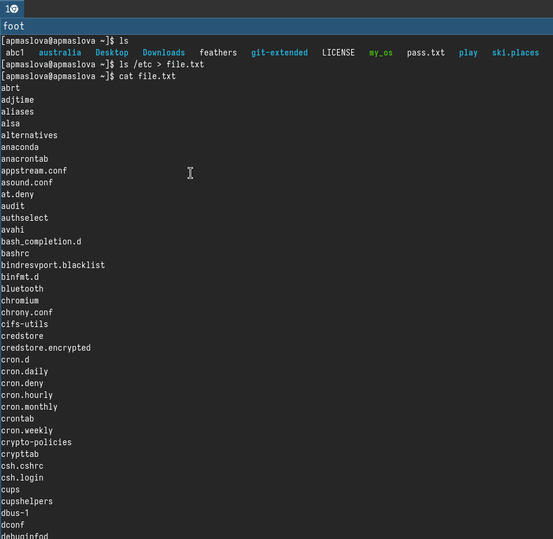{.column width="30%"}

## Дописали названия файлов из домашней директории

Допишем в этот же файл названия файлов, содержащихся в нашем домашнем каталоге.

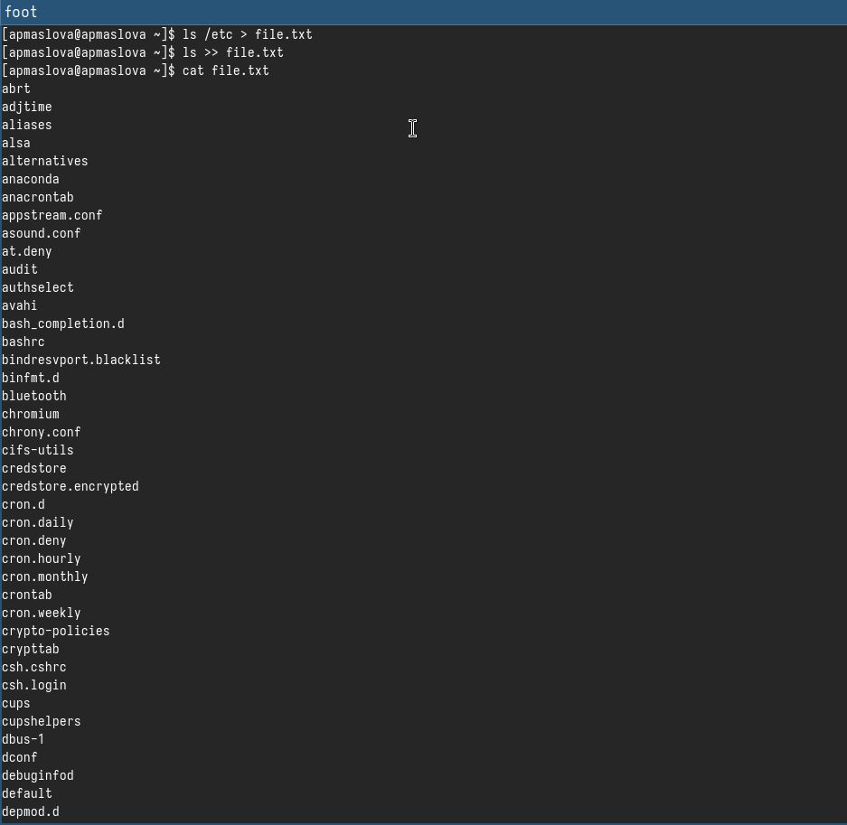{.column width="30%"}

## Вывод файлов .conf

Выведем имена всех файлов из `file.txt`, имеющих расширение `.conf`.

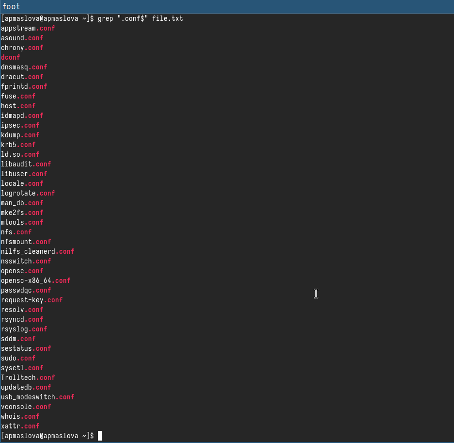{.column width="30%"}

## Запись файлов .conf в conf.txt

После этого запишем их в новый текстовой файл `conf.txt`.

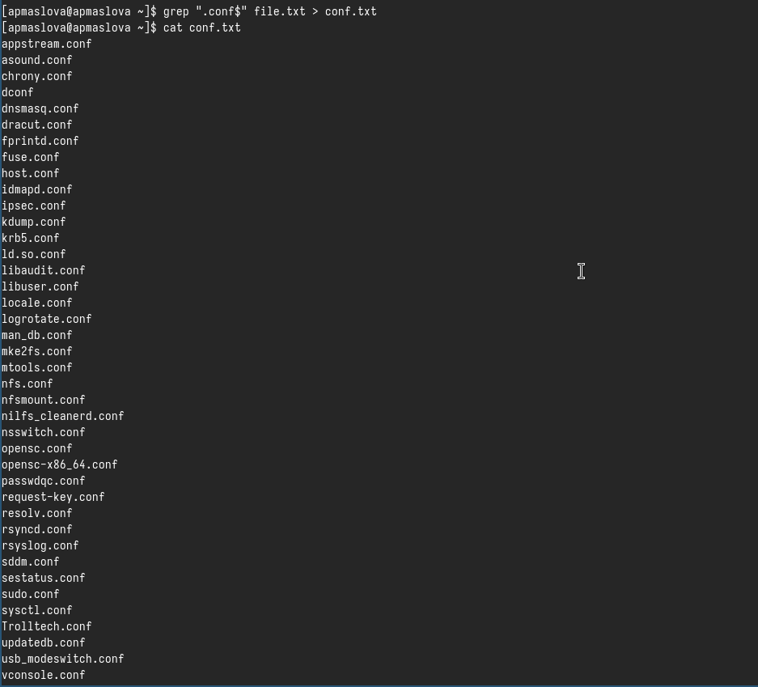{.column width="30%"}

## Вывод файлов на "с"

Определим, какие файлы в нашем домашнем каталоге имеют имена, начинавшиеся с символа *c*.

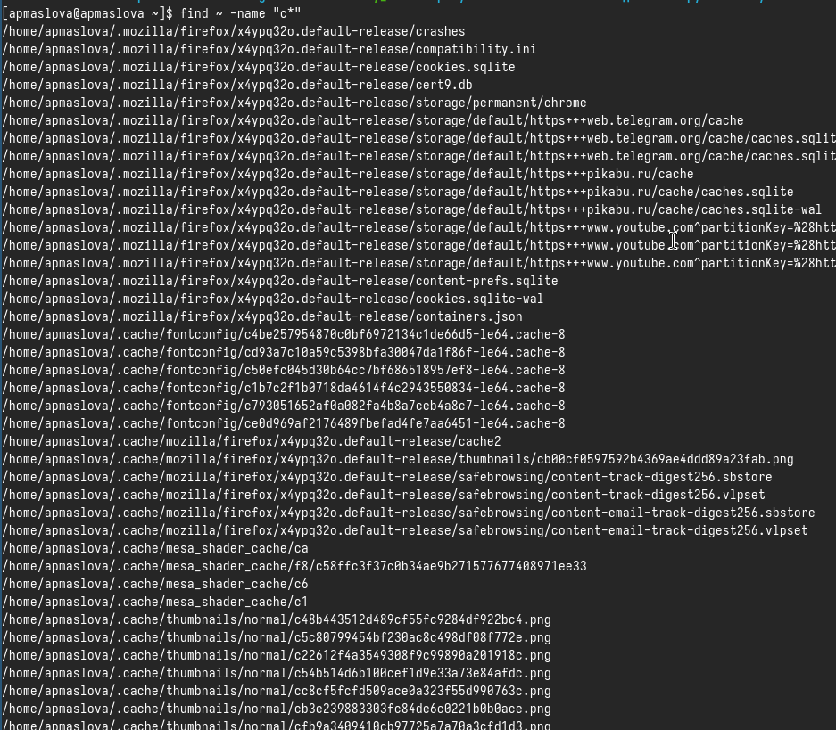{.column width="30%"}

## Вывод файлов на "h"

Выведем на экран имена файлов из каталога `/etc`, начинающиеся с символа *h*.

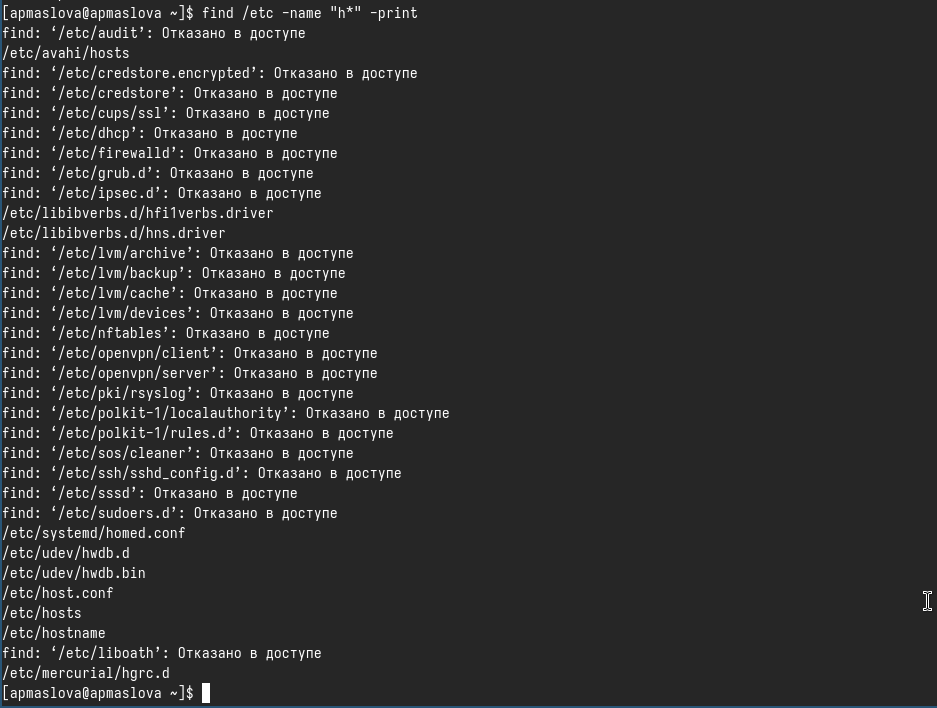{.column width="30%"}

## Запись файлов в фоновом режиме

Запустим в фоновом режиме процесс, который будет записывать в файл `~/logfile` файлы, имена которых начинаются с *log*. Удалим файл `~/logfile`.

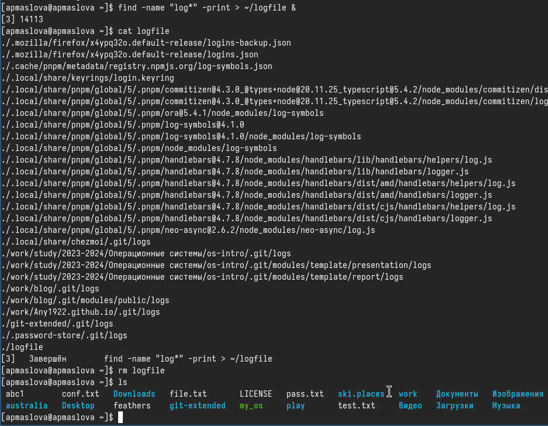{.column width="30%"}

## Gedit в фоновом режиме

Запустим из консоли в фоновом режиме редактор *gedit*.

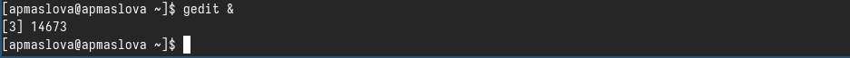{.column width="30%"}

## Идентификатор процесса gedit

Определим идентификатор процесса *gedit*, используя команду `ps`, конвейер и фильтр `grep`.

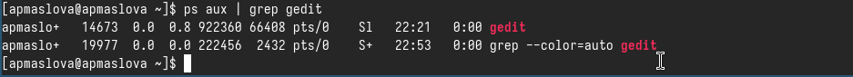{.column width="30%"}

## Команда kill

Прочтём справку (`man`) команды `kill`.

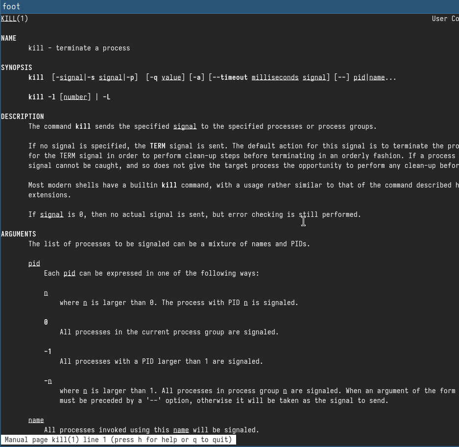{.column width="30%"}

## Завершение процесса gedit

После этого используем её для завершения процесса *gedit*.

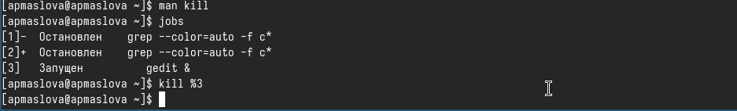{.column width="30%"}

## Команда df

Выполним команды `df` и `du`, предварительно получив более подробную информацию об этих командах, с помощью команды `man`.

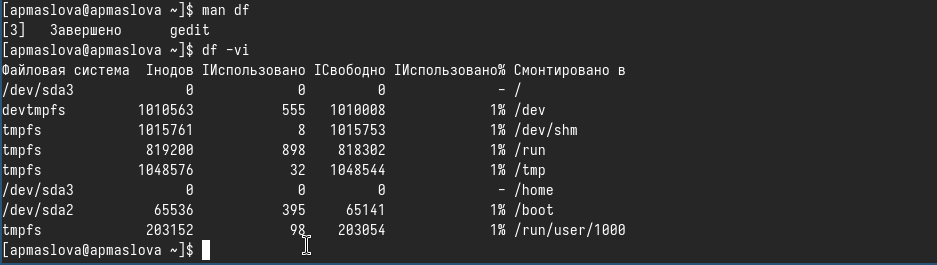{.column width="30%"}

## Команда du

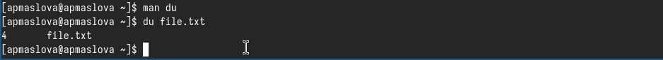{.column width="30%"}

## Вывод имён директорий домашнего каталога

Воспользовавшись справкой команды `find`, выведем имена всех директорий, имеющихся в нашем домашнем каталоге.

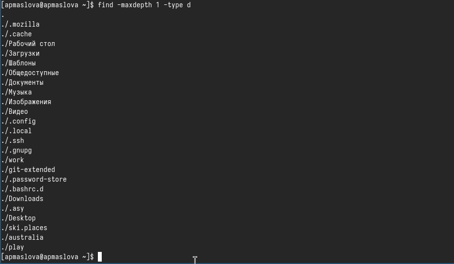{.column width="30%"}

# Выводы

Ознакомилась с инструментами поиска файлов и фильтрации текстовых данных. Приобрели практические навыки: по управлению процессами (и заданиями), по проверке использования диска и обслуживанию файловых систем.

