---
## Front matter
title: "Отчёт по лабораторной работе №8"
subtitle: "Дисциплина: Операционные системы"
author: "Маслова Анна Павловна"

## Generic otions
lang: ru-RU
toc-title: "Содержание"

## Bibliography
bibliography: bib/cite.bib
csl: pandoc/csl/gost-r-7-0-5-2008-numeric.csl

## Pdf output format
toc: true # Table of contents
toc-depth: 2
lof: true # List of figures
lot: true # List of tables
fontsize: 12pt
linestretch: 1.5
papersize: a4
documentclass: scrreprt
## I18n polyglossia
polyglossia-lang:
  name: russian
  options:
	- spelling=modern
	- babelshorthands=true
polyglossia-otherlangs:
  name: english
## I18n babel
babel-lang: russian
babel-otherlangs: english
## Fonts
mainfont: PT Serif
romanfont: PT Serif
sansfont: PT Sans
monofont: PT Mono
mainfontoptions: Ligatures=TeX
romanfontoptions: Ligatures=TeX
sansfontoptions: Ligatures=TeX,Scale=MatchLowercase
monofontoptions: Scale=MatchLowercase,Scale=0.9
## Biblatex
biblatex: true
biblio-style: "gost-numeric"
biblatexoptions:
  - parentracker=true
  - backend=biber
  - hyperref=auto
  - language=auto
  - autolang=other*
  - citestyle=gost-numeric
## Pandoc-crossref LaTeX customization
figureTitle: "Рис."
tableTitle: "Таблица"
listingTitle: "Листинг"
lofTitle: "Список иллюстраций"
lotTitle: "Список таблиц"
lolTitle: "Листинги"
## Misc options
indent: true
header-includes:
  - \usepackage{indentfirst}
  - \usepackage{float} # keep figures where there are in the text
  - \floatplacement{figure}{H} # keep figures where there are in the text
---

# Цель работы

Ознакомление с инструментами поиска файлов и фильтрации текстовых данных. Приобретение практических навыков: по управлению процессами (и заданиями), по проверке использования диска и обслуживанию файловых систем.

# Выполнение лабораторной работы

Осуществили вход в систему, используя наше имя пользователя. Запишем в файл `file.txt` названия файлов, содержащихся в каталоге `/etc` (рис. [-@fig:001]).

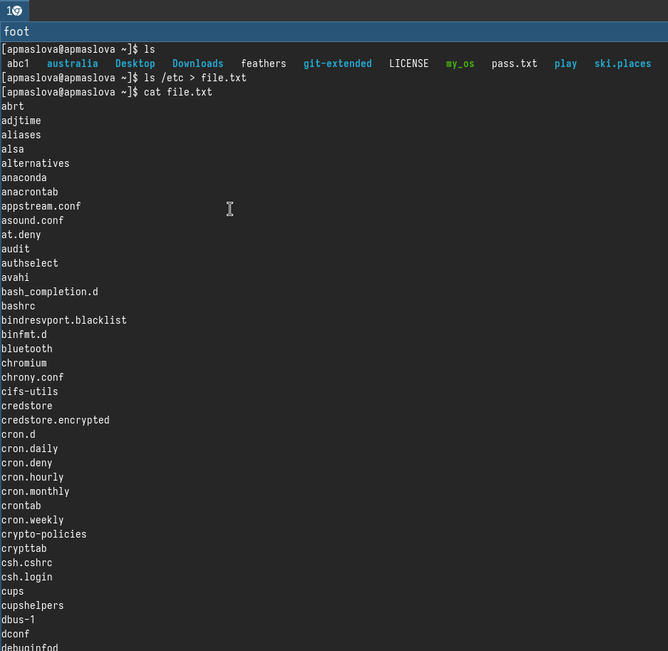{#fig:001 width=70%}

Допишем в этот же файл названия файлов, содержащихся в нашем домашнем каталоге (рис. [-@fig:002]).

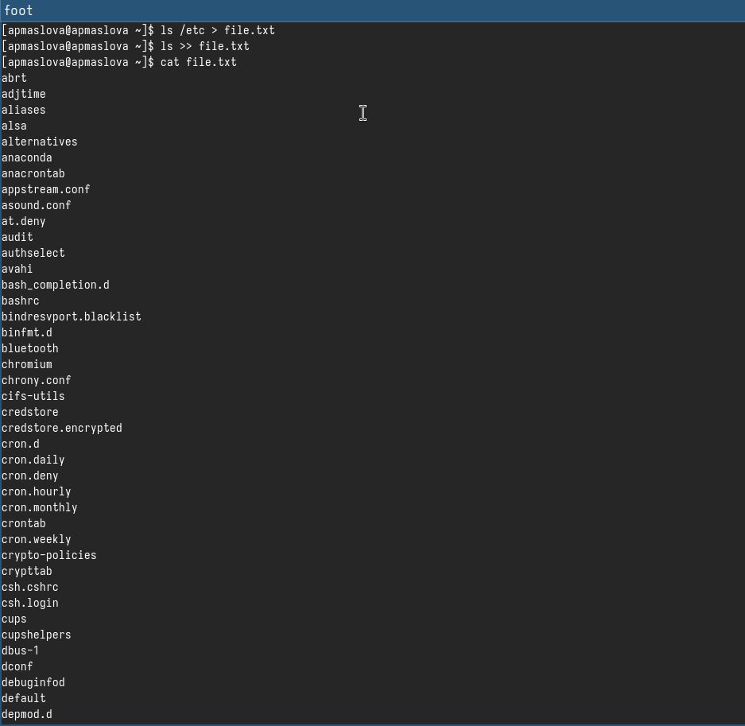{#fig:002 width=70%}

Выведем имена всех файлов из `file.txt`, имеющих расширение `.conf` (рис. [-@fig:003]).

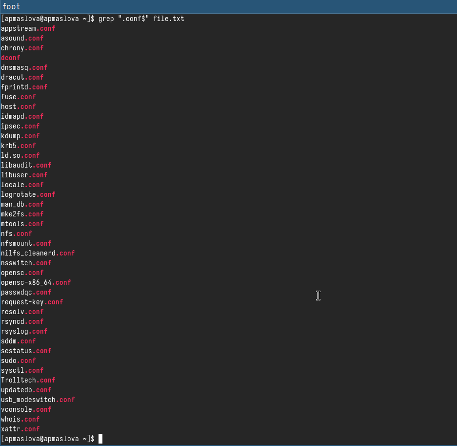{#fig:003 width=70%}

После этого запишем их в новый текстовой файл `conf.txt` (рис. [-@fig:004]).

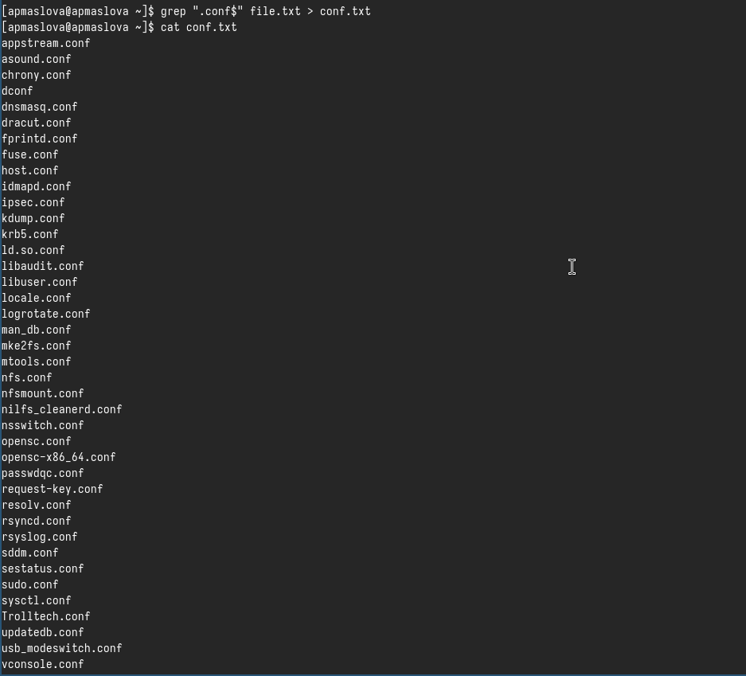{#fig:004 width=70%}

Определим, какие файлы в нашем домашнем каталоге имеют имена, начинавшиеся с символа *c* (рис. [-@fig:005]).

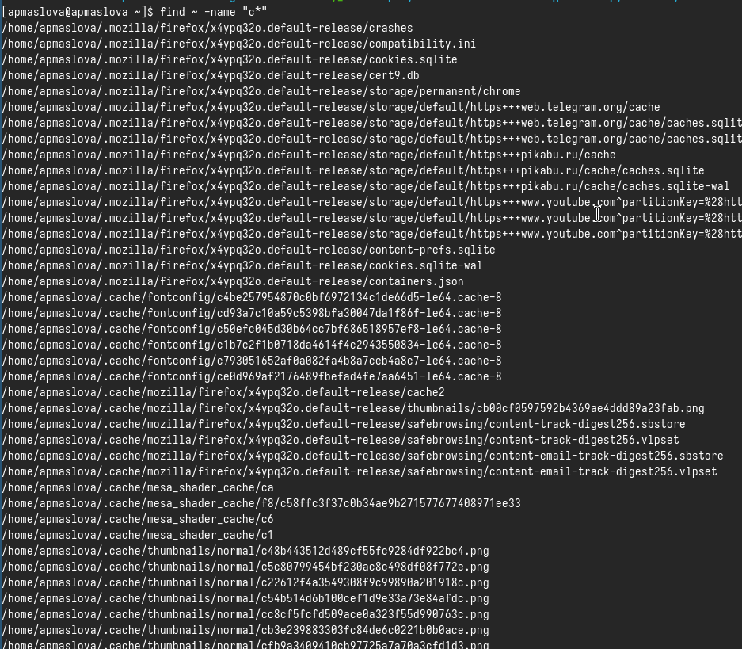{#fig:005 width=70%}

Выведем на экран имена файлов из каталога `/etc`, начинающиеся с символа *h* (рис. [-@fig:006]).

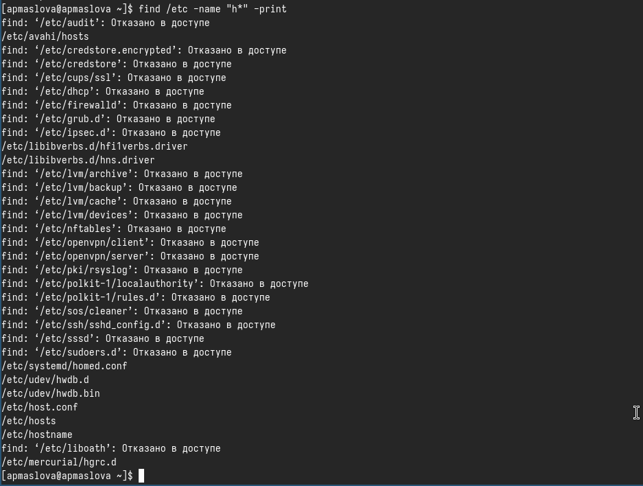{#fig:006 width=70%}

Запустим в фоновом режиме процесс, который будет записывать в файл `~/logfile` файлы, имена которых начинаются с *log*. Удалим файл `~/logfile` (рис. [-@fig:007]).

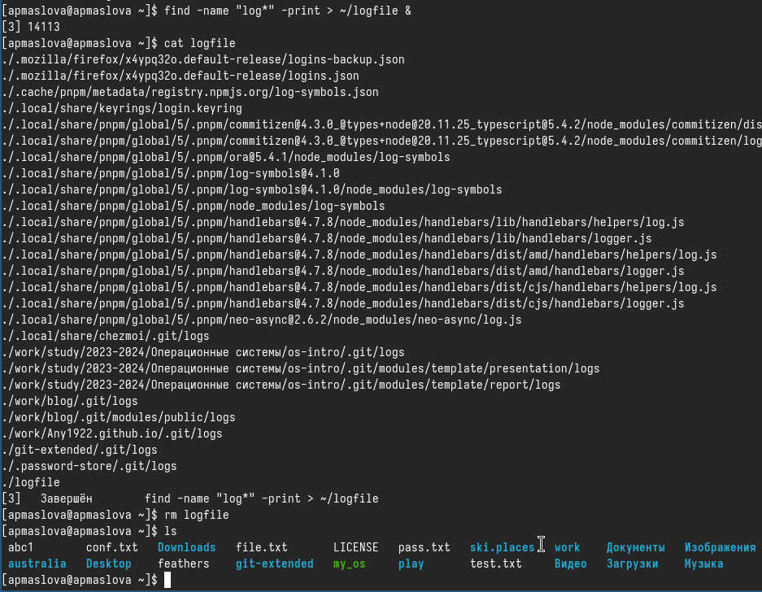{#fig:007 width=70%}

Запустим из консоли в фоновом режиме редактор *gedit* (рис. [-@fig:008]).

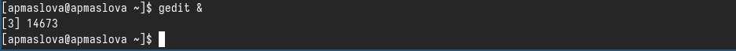{#fig:008 width=70%}

Определим идентификатор процесса *gedit*, используя команду `ps`, конвейер и фильтр `grep` (рис. [-@fig:009]).

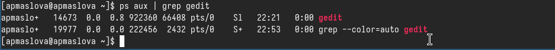{#fig:009 width=70%}

Прочтём справку (`man`) команды `kill` (рис. [-@fig:010]).

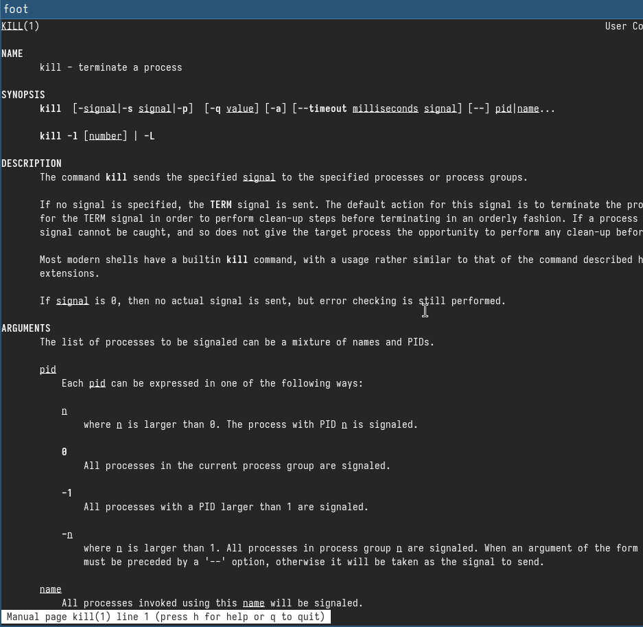{#fig:010 width=70%}

После этого используем её для завершения процесса *gedit* (рис. [-@fig:011]).

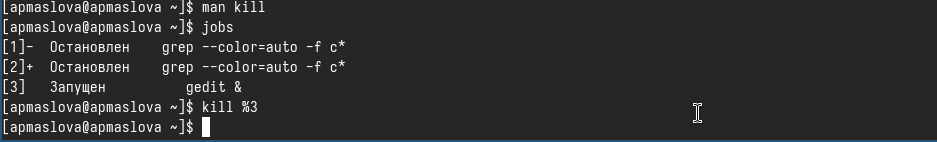{#fig:011 width=70%}

Выполним команды `df` и `du`, предварительно получив более подробную информацию об этих командах, с помощью команды `man` (рис. [-@fig:012]), (рис. [-@fig:013]).

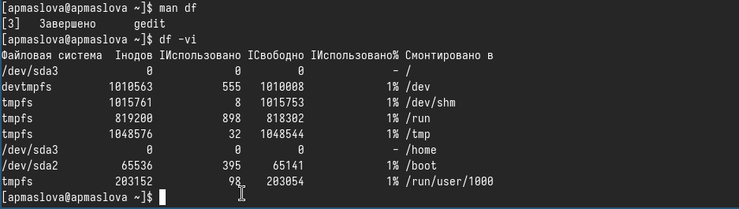{#fig:012 width=70%}

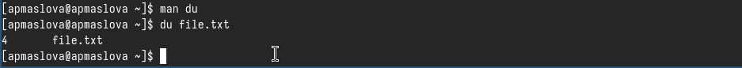{#fig:013 width=70%}

Воспользовавшись справкой команды `find`, выведем имена всех директорий, имеющихся в нашем домашнем каталоге (рис. [-@fig:014]).

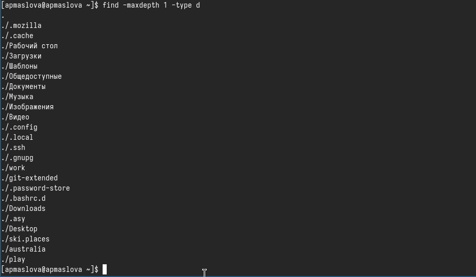{#fig:014 width=70%}

# Ответы на контрольные вопросы

1. Потоки ввода-вывода в Linux:

- Стандартный поток ввода (stdin) - обычно связан с клавиатурой.
- Стандартный поток вывода (stdout) - обычно связан с экраном (монитором).
- Стандартный поток ошибок (stderr) - используется для вывода сообщений об ошибках.
2. Разница между операциями > и >> в Linux:
Операция > используется для перенаправления вывода команды в файл, при этом существующий файл будет перезаписан.
Операция >> также перенаправляет вывод команды в файл, но при этом информация добавляется в конец файла, не удаляя предыдущее содержимое.
3. Конвейер - это механизм, который позволяет объединять вывод одной команды с вводом другой команды для последующей обработки данных.
4. Процесс в Linux - это запущенная программа, которая выполняется в операционной системе. Программа - это набор инструкций, которые выполняются процессором. 
5. PID (Process ID) и GID (Group ID) - это уникальные идентификаторы процессов и групп процессов в системе.
6. Задачи в Linux - это выполняемые процессы. Команда, позволяющая управлять задачами, - это "ps" (Process Status), которая позволяет отображать информацию о процессах, запущенных в системе, и управлять ими.
7. Утилиты top и htop - это программы для мониторинга процессов в операционной системе. Top показывает динамическую информацию о процессах, а htop предоставляет более детальную информацию и удобный интерфейс для управления процессами.
8. Команда поиска файлов в Linux - это "find". Она используется для поиска файлов и директорий в указанном каталоге на основе различных критериев. Например, "find /home/user -name "*.txt"" найдет все файлы с расширением .txt в директории /home/user.
9. По контексту нельзя найти файл, но можно искать файлы по ключевым словам, содержащимся в них, используя команду "grep". Например, "grep -r "keyword" /path/to/directory" ищет все файлы в указанной директории, содержащие ключевое слово "keyword".
10. Для определения объема свободной памяти на жестком диске используется команда "df". Например, "df -h" покажет информацию о доступном месте на диске с удобным выводом в читаемом формате.
11. Для определения объема вашего домашнего каталога можно использовать команду "du" (Disk Usage). Например, "du -sh /home/user" покажет общий размер домашнего каталога пользователя.
12. Для удаления зависшего процесса можно использовать команду "kill" с PID процесса. Например, "kill -9 PID" принудительно завершит процесс с указанным PID.

# Выводы

Ознакомилась с инструментами поиска файлов и фильтрации текстовых данных. Приобрели практические навыки: по управлению процессами (и заданиями), по проверке использования диска и обслуживанию файловых систем.

# Список литературы{.unnumbered}

1. Dash, P. Getting Started with Oracle VM VirtualBox / P. Dash. – Packt Publishing Ltd, 2013. – 86 сс.
2. Colvin, H. VirtualBox: An Ultimate Guide Book on Virtualization with VirtualBox. VirtualBox / H. Colvin. – CreateSpace Independent Publishing Platform, 2015. – 70 сс.
3. Vugt, S. van. Red Hat RHCSA/RHCE 7 cert guide : Red Hat Enterprise Linux 7 (EX200 and EX300) : Certification Guide. Red Hat RHCSA/RHCE 7 cert guide / S. van Vugt. – Pearson IT Certification, 2016. – 1008 сс.
4. Робачевский, А. Операционная система UNIX / А. Робачевский, С. Немнюгин, О. Стесик. – 2-е изд. – Санкт-Петербург : БХВ-Петербург, 2010. – 656 сс.
5. Немет, Э. Unix и Linux: руководство системного администратора. Unix и Linux / Э. Немет, Г. Снайдер, Т.Р. Хейн, Б. Уэйли. – 4-е изд. – Вильямс, 2014. – 1312 сс.
6. Колисниченко, Д.Н. Самоучитель системного администратора Linux : Системный администратор / Д.Н. Колисниченко. – Санкт-Петербург : БХВ-Петербург, 2011. – 544 сс.
7. Robbins, A. Bash Pocket Reference / A. Robbins. – O’Reilly Media, 2016. – 156 сс.
