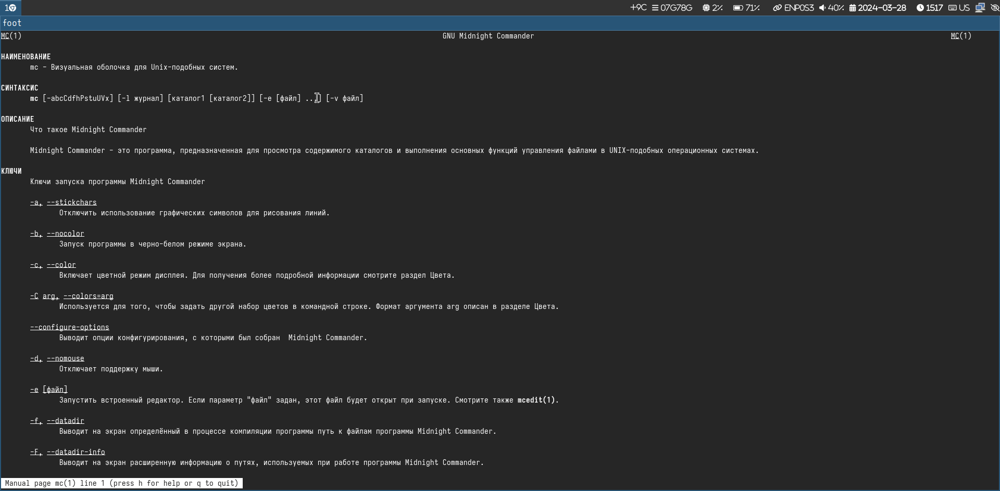
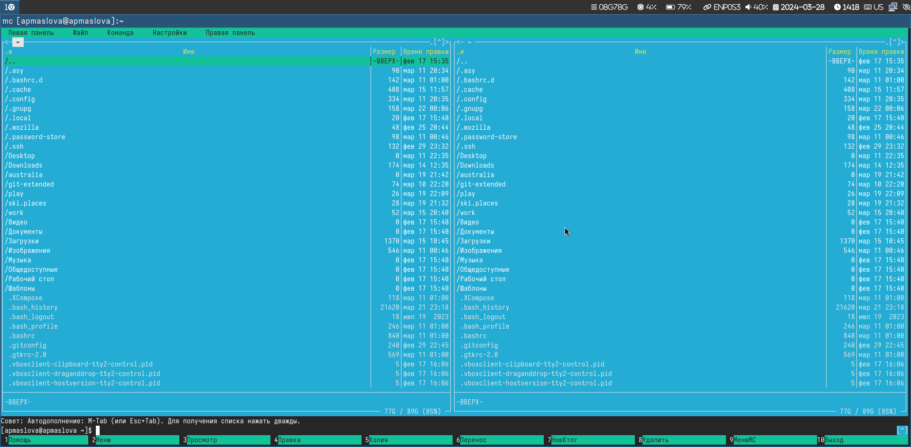
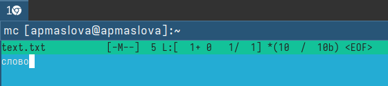

---
## Front matter
title: "Отчёт по лабораторной работе №9"
subtitle: "дисциплина: Операционные системы"
author: "Маслова Анна Павловна"

## Generic otions
lang: ru-RU
toc-title: "Содержание"

## Bibliography
bibliography: bib/cite.bib
csl: pandoc/csl/gost-r-7-0-5-2008-numeric.csl

## Pdf output format
toc: true # Table of contents
toc-depth: 2
lof: true # List of figures
lot: true # List of tables
fontsize: 12pt
linestretch: 1.5
papersize: a4
documentclass: scrreprt
## I18n polyglossia
polyglossia-lang:
  name: russian
  options:
	- spelling=modern
	- babelshorthands=true
polyglossia-otherlangs:
  name: english
## I18n babel
babel-lang: russian
babel-otherlangs: english
## Fonts
mainfont: PT Serif
romanfont: PT Serif
sansfont: PT Sans
monofont: PT Mono
mainfontoptions: Ligatures=TeX
romanfontoptions: Ligatures=TeX
sansfontoptions: Ligatures=TeX,Scale=MatchLowercase
monofontoptions: Scale=MatchLowercase,Scale=0.9
## Biblatex
biblatex: true
biblio-style: "gost-numeric"
biblatexoptions:
  - parentracker=true
  - backend=biber
  - hyperref=auto
  - language=auto
  - autolang=other*
  - citestyle=gost-numeric
## Pandoc-crossref LaTeX customization
figureTitle: "Рис."
tableTitle: "Таблица"
listingTitle: "Листинг"
lofTitle: "Список иллюстраций"
lotTitle: "Список таблиц"
lolTitle: "Листинги"
## Misc options
indent: true
header-includes:
  - \usepackage{indentfirst}
  - \usepackage{float} # keep figures where there are in the text
  - \floatplacement{figure}{H} # keep figures where there are in the text
---

# Цель работы

Освоение основных возможностей командной оболочки Midnight Commander. Приобретение навыков практической работы по просмотру каталогов и файлов; манипуляций с ними.

# Выполнение лабораторной работы

Изучите информацию о mc, вызвав в командной строке man mc (рис. [-@fig:001]).

{#fig:001 width=70%}

Запустите из командной строки mc, изучите его структуру и меню. (рис. [-@fig:002])

{#fig:002 width=70%}

Выполним задания: 

3. Выполните несколько операций в mc, используя управляющие клавиши (операции
с панелями; выделение/отмена выделения файлов, копирование/перемещение фай-
лов, получение информации о размере и правах доступа на файлы и/или каталоги
и т.п.)
4. Выполните основные команды меню левой (или правой) панели. Оцените степень
подробности вывода информации о файлах.
5. Используя возможности подменю Файл , выполните:
– просмотр содержимого текстового файла;
– редактирование содержимого текстового файла (без сохранения результатов
редактирования);
– создание каталога;
– копирование в файлов в созданный каталог.
6. С помощью соответствующих средств подменю Команда осуществите:
– поиск в файловой системе файла с заданными условиями (например, файла
с расширением .c или .cpp, содержащего строку main);
– выбор и повторение одной из предыдущих команд;
– переход в домашний каталог;
– анализ файла меню и файла расширений.
7. Вызовите подменю Настройки . Освойте операции, определяющие структуру экрана mc
(Full screen, Double Width, Show Hidden Files и т.д.)

Далее выполним задания для mc:

1. Создайте текстовой файл text.txt. (рис. [-@fig:003])
2. Откройте этот файл с помощью встроенного в mc редактора.
3. Вставьте в открытый файл небольшой фрагмент текста, скопированный из любого
другого файла или Интернета.
4. Проделайте с текстом следующие манипуляции, используя горячие клавиши:
4.1. Удалите строку текста.
4.2. Выделите фрагмент текста и скопируйте его на новую строку.
4.3. Выделите фрагмент текста и перенесите его на новую строку.
4.4. Сохраните файл.
4.5. Отмените последнее действие.
4.6. Перейдите в конец файла (нажав комбинацию клавиш) и напишите некоторый
текст.
4.7. Перейдите в начало файла (нажав комбинацию клавиш) и напишите некоторый
текст.
4.8. Сохраните и закройте файл.
5. Откройте файл с исходным текстом на некотором языке программирования (напри-
мер C или Java)
6. Используя меню редактора, включите подсветку синтаксиса, если она не включена,
или выключите, если она включена. 

{#fig:003 width=70%}

# Ответы на контрольные вопросы

1. Режимы работы в Midnight Commander (mc):

   - Обычный режим (Command Line Mode): В этом режиме отображается интерфейс в стиле двухпанельного файлового менеджера, где пользователь может управлять файлами и каталогами с помощью клавиатуры. Основная часть окна занята двумя панелями (левой и правой).
  
   - Внутренний редактор (Editor Mode): Позволяет просматривать и редактировать текстовые файлы прямо внутри Midnight Commander. Для перехода в этот режим можно открыть файл и нажать клавишу F4.

2. Операции с файлами в mc:

   - Shell Commands: В mc можно выполнять различные операции с файлами, как с помощью команд встроенной оболочки (например, копирование, перемещение, удаление файлов), так и с помощью горячих клавиш. Например:
     - Копирование файла: F5 для копирования, F6 для переноса файлов.
     - Удаление файла: F8 для удаления файла.
     - Переименование файла: F6 для переименования.
     
3. Структура меню левой (или правой) панели в mc:

   - Навигация по файловой системе: Здесь отображаются файлы и каталоги текущего рабочего каталога.
   - Команды для управления файлами: Можно скопировать, переместить, удалить файлы, создать каталог и многое другое.

4. Структура меню "Файл" в mc:

   - Открыть файл: Позволяет открыть выбранный файл.
   - Копировать/Переместить/Удалить файл: Действия для работы с файлами.
   - Создать каталог: Создание нового каталога.
   - Изменить права доступа: Изменение прав доступа к файлам.
  
5. Структура меню "Команда" в mc:

   - Выполнить команду: Позволяет выполнить произвольную команду.
   - Выполнить в системном shell: Запуск команды во внешней оболочке.
  
6. Структура меню "Настройки" в mc:

   - Настройки интерфейса: Изменение внешнего вида и поведения программы.
   - Настройки клавиш: Управление горячими клавишами.
   - Другие параметры: Настройки отображения, прав доступа и другие.

7. Встроенные команды в mc:

   - F1 - Help: Помощь по командам mc.
   - F2 - User Menu: Пользовательское меню.
   - F3 - View: Просмотр текстовых файлов.
   - F4 - Edit: Редактирование файла во встроенном редакторе mc.
   - F5, F6, F7, F8: Команды копирования, перемещения, создания каталога и удаления файлов.
   
8. Команды встроенного редактора в mc:

   - Ctrl+O: Сохранить изменения.
   - Ctrl+X: Выйти из редактора.
   - Ctrl+R: Поиск и замена текста.
   
9. Средства mc для создания пользовательских меню:

   - User Menu: Позволяет настроить пользовательское меню с произвольными командами для удобного доступа.

10. Средства mc для действий, определяемых пользователем, над текущим файлом:

    - Возможность запуска внешних программ: mc позволяет запускать произвольные внешние программы для обработки текущего файла (например, просмотр изображений во внешнем просмотрщике).

# Выводы

Освоили основные возможности командной оболочки Midnight Commander. Приобрели навыки практической работы по просмотру каталогов и файлов; манипуляций с ними.

# Список литературы{.unnumbered}

1. Dash, P. Getting Started with Oracle VM VirtualBox / P. Dash. – Packt Publishing Ltd, 2013. – 86 сс.
2. Colvin, H. VirtualBox: An Ultimate Guide Book on Virtualization with VirtualBox. VirtualBox / H. Colvin. – CreateSpace Independent Publishing Platform, 2015. – 70 сс.
3. Vugt, S. van. Red Hat RHCSA/RHCE 7 cert guide : Red Hat Enterprise Linux 7 (EX200 and EX300) : Certification Guide. Red Hat RHCSA/RHCE 7 cert guide / S. van Vugt. – Pearson IT Certification, 2016. – 1008 сс.
4. Робачевский, А. Операционная система UNIX / А. Робачевский, С. Немнюгин, О. Стесик. – 2-е изд. – Санкт-Петербург : БХВ-Петербург, 2010. – 656 сс.
5. Немет, Э. Unix и Linux: руководство системного администратора. Unix и Linux / Э. Немет, Г. Снайдер, Т.Р. Хейн, Б. Уэйли. – 4-е изд. – Вильямс, 2014. – 1312 сс.
6. Колисниченко, Д.Н. Самоучитель системного администратора Linux : Системный администратор / Д.Н. Колисниченко. – Санкт-Петербург : БХВ-Петербург, 2011. – 544 сс.
7. Robbins, A. Bash Pocket Reference / A. Robbins. – O’Reilly Media, 2016. – 156 сс.
