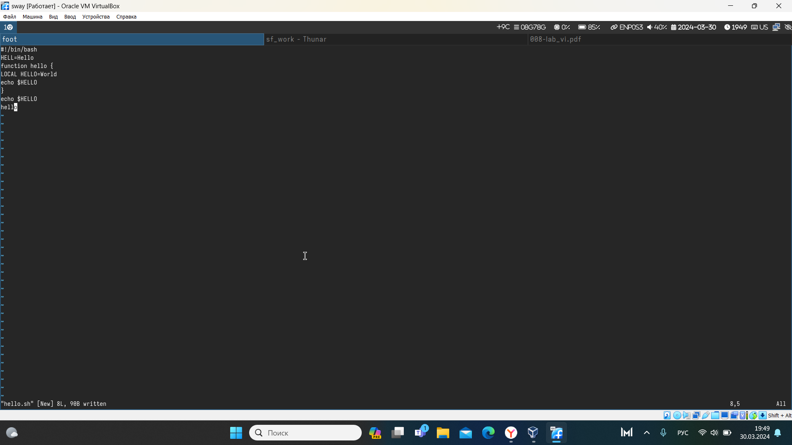
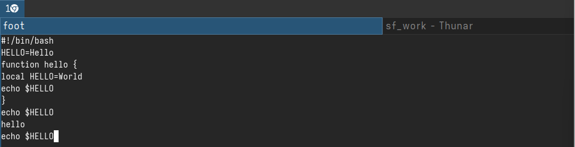

---
## Front matter
title: "Отчёт по лабораторной работе №10"
subtitle: "дисциплина: Операционные системы"
author: "Маслова Анна Павловна"

## Generic otions
lang: ru-RU
toc-title: "Содержание"

## Bibliography
bibliography: bib/cite.bib
csl: pandoc/csl/gost-r-7-0-5-2008-numeric.csl

## Pdf output format
toc: true # Table of contents
toc-depth: 2
lof: true # List of figures
lot: true # List of tables
fontsize: 12pt
linestretch: 1.5
papersize: a4
documentclass: scrreprt
## I18n polyglossia
polyglossia-lang:
  name: russian
  options:
	- spelling=modern
	- babelshorthands=true
polyglossia-otherlangs:
  name: english
## I18n babel
babel-lang: russian
babel-otherlangs: english
## Fonts
mainfont: PT Serif
romanfont: PT Serif
sansfont: PT Sans
monofont: PT Mono
mainfontoptions: Ligatures=TeX
romanfontoptions: Ligatures=TeX
sansfontoptions: Ligatures=TeX,Scale=MatchLowercase
monofontoptions: Scale=MatchLowercase,Scale=0.9
## Biblatex
biblatex: true
biblio-style: "gost-numeric"
biblatexoptions:
  - parentracker=true
  - backend=biber
  - hyperref=auto
  - language=auto
  - autolang=other*
  - citestyle=gost-numeric
## Pandoc-crossref LaTeX customization
figureTitle: "Рис."
tableTitle: "Таблица"
listingTitle: "Листинг"
lofTitle: "Список иллюстраций"
lotTitle: "Список таблиц"
lolTitle: "Листинги"
## Misc options
indent: true
header-includes:
  - \usepackage{indentfirst}
  - \usepackage{float} # keep figures where there are in the text
  - \floatplacement{figure}{H} # keep figures where there are in the text
---

# Цель работы

Познакомиться с операционной системой Linux. Получить практические навыки работы с редактором vi, установленным по умолчанию практически во всех дистрибутивах.

# Выполнение лабораторной работы

Выполним задание №1:

1. Создайте каталог с именем `~/work/os/lab06`.
2. Перейдите во вновь созданный каталог.
3. Вызовите `vi` и создайте файл `hello.sh`

`vi hello.sh`

4. Нажмите клавишу `i` и вводите следующий текст.

```nasm
#!/bin/bash
HELL=Hello
function hello {
LOCAL HELLO=World
echo $HELLO
}
echo $HELLO
hello
```

(рис. [-@fig:001]).

{#fig:001 width=70%}

5. Нажмите клавишу `Esc` для перехода в командный режим после завершения ввода текста.
6. Нажмите `:` для перехода в режим последней строки и внизу вашего экрана появится приглашение в виде двоеточия.
7. Нажмите `w` (записать) и `q` (выйти), а затем нажмите клавишу `Enter` для сохранения вашего текста и завершения работы.
8. Сделайте файл исполняемым

`chmod +x hello.sh`

Выполним задание №2:

1. Вызовите `vi` на редактирование файла

`vi ~/work/os/lab06/hello.sh`

2. Установите курсор в конец слова `HELL` второй строки.
3. Перейдите в режим вставки и замените на `HELLO`. Нажмите `Esc` для возврата в командный режим.
4. Установите курсор на четвертую строку и сотрите слово `LOCAL`.
5. Перейдите в режим вставки и наберите следующий текст: `local`, нажмите `Esc` для возврата в командный режим.
6. Установите курсор на последней строке файла. Вставьте после неё строку, содержащую следующий текст: `echo $HELLO`.
7. Нажмите `Esc` для перехода в командный режим.
8. Удалите последнюю строку.
9. Введите команду отмены изменений u для отмены последней команды.
10. Введите символ `:` для перехода в режим последней строки. Запишите произведённые изменения и выйдите из `vi`.

(рис. [-@fig:002]).

{#fig:002 width=70%}

# Ответы на контрольные вопросы

Режимы работы редактора vi:

Режим вставки (Insert mode): позволяет вводить текст.
Командный режим (Command mode): используется для перемещения по тексту и выполнения команд.
Для выхода из редактора vi без сохранения изменений необходимо выполнить команду ":q!".

Команды позиционирования в редакторе vi:

h - перемещение влево
j - перемещение вниз
k - перемещение вверх
l - перемещение вправо
Словом для редактора vi является последовательность букв, цифр и символов '_', начинающаяся с буквы.

Чтобы перейти в начало файла, в командном режиме необходимо нажать клавишу Shift + g. Для перехода в конец файла нужно нажать клавишу g.

Основные группы команд редактирования в редакторе vi:

Удаление
Копирование
Вставка
Отмена
Поиск и замена
Для заполнения строки символами $ в командном режиме необходимо использовать команду ":s/$/символ/".

Для отмены некорректного действия в редакторе vi можно использовать команду ":u" (undo).

Основные группы команд режима последней строки:

Сохранение изменений
Замена
Выход из редактора
Чтобы определить позицию, в которой заканчивается строка, не перемещая курсор, можно воспользоваться командой "$" в командном режиме.

Для анализа опций редактора vi можно воспользоваться командой ":set", чтобы посмотреть текущие установки опций.

Режим работы редактора vi отображается в нижнем левом углу экрана.

Граф взаимосвязи режимов работы редактора vi:

Режим вставки (Insert mode) |
Командный режим (Command mode) \ /
Режим экрана (Ex mode)


# Выводы

Познакомились с операционной системой Linux. Получили практические навыки работы с редактором vi, установленным по умолчанию практически во всех дистрибутивах.

# Список литературы{.unnumbered}

1. Dash, P. Getting Started with Oracle VM VirtualBox / P. Dash. – Packt Publishing Ltd, 2013. – 86 сс.
2. Colvin, H. VirtualBox: An Ultimate Guide Book on Virtualization with VirtualBox. VirtualBox / H. Colvin. – CreateSpace Independent Publishing Platform, 2015. – 70 сс.
3. Vugt, S. van. Red Hat RHCSA/RHCE 7 cert guide : Red Hat Enterprise Linux 7 (EX200 and EX300) : Certification Guide. Red Hat RHCSA/RHCE 7 cert guide / S. van Vugt. – Pearson IT Certification, 2016. – 1008 сс.
4. Робачевский, А. Операционная система UNIX / А. Робачевский, С. Немнюгин, О. Стесик. – 2-е изд. – Санкт-Петербург : БХВ-Петербург, 2010. – 656 сс.
5. Немет, Э. Unix и Linux: руководство системного администратора. Unix и Linux / Э. Немет, Г. Снайдер, Т.Р. Хейн, Б. Уэйли. – 4-е изд. – Вильямс, 2014. – 1312 сс.
6. Колисниченко, Д.Н. Самоучитель системного администратора Linux : Системный администратор / Д.Н. Колисниченко. – Санкт-Петербург : БХВ-Петербург, 2011. – 544 сс.
7. Robbins, A. Bash Pocket Reference / A. Robbins. – O’Reilly Media, 2016. – 156 сс.
