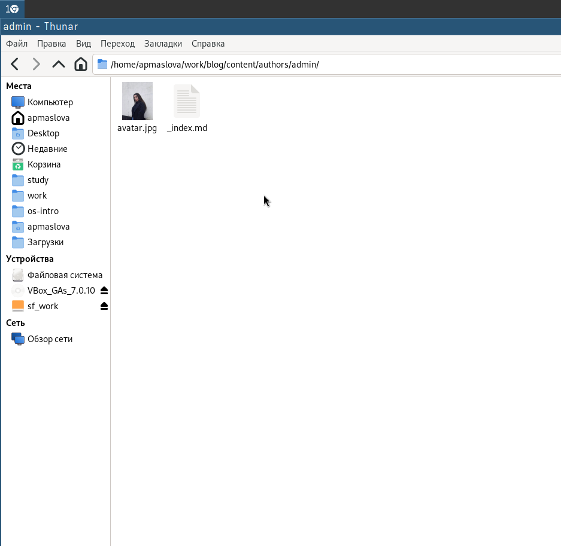
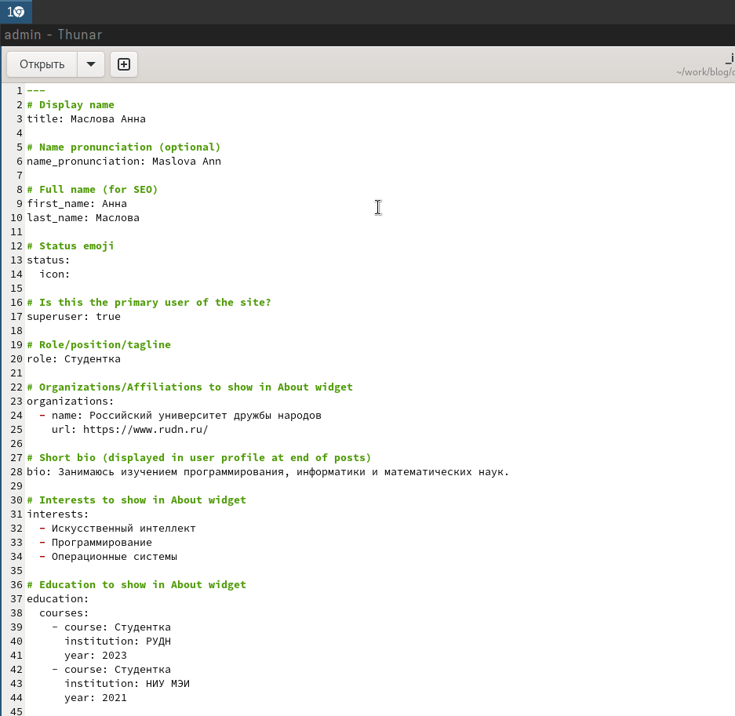
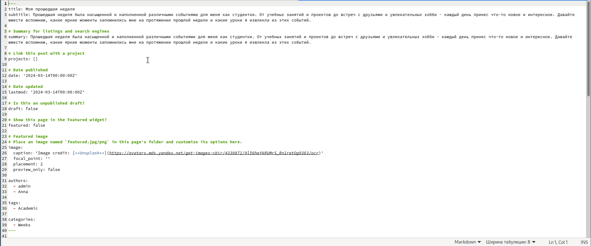
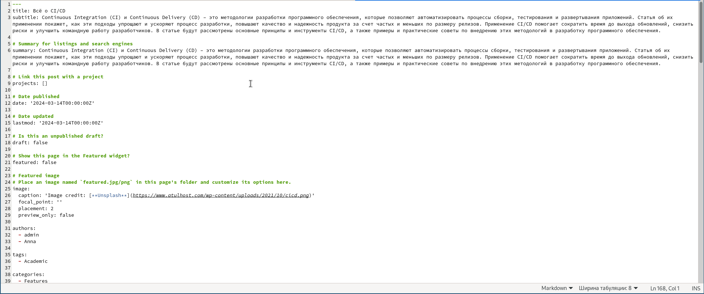
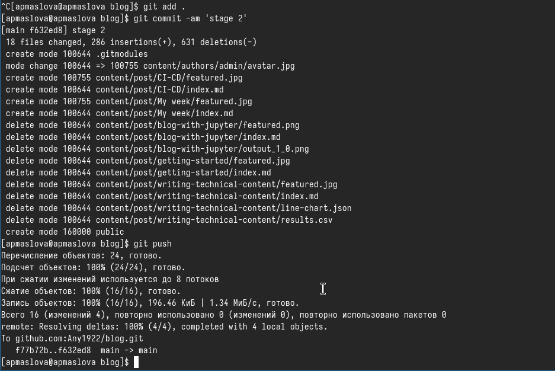
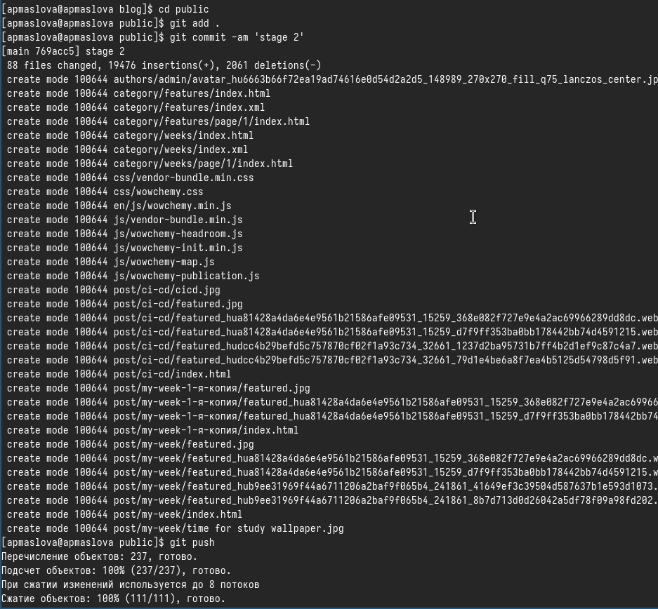
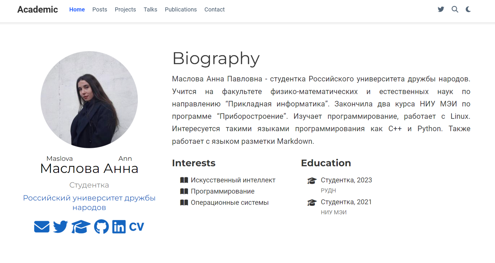
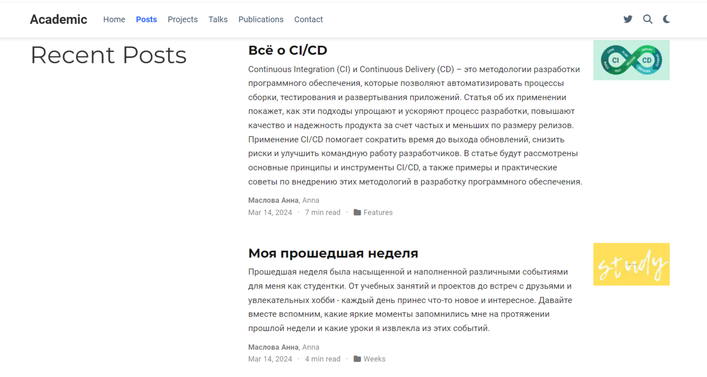

---
## Front matter
lang: ru-RU
title: Презентация по работе над персональным проектом
subtitle: Этап 2
author:
  - Маслова А.П.
institute:
  - Российский университет дружбы народов, Москва, Россия
date: 14 марта 2024

## i18n babel
babel-lang: russian
babel-otherlangs: english

## Formatting pdf
toc: false
toc-title: Содержание
slide_level: 2
aspectratio: 169
section-titles: true
theme: metropolis
header-includes:
 - \metroset{progressbar=frametitle,sectionpage=progressbar,numbering=fraction}
 - '\makeatletter'
 - '\beamer@ignorenonframefalse'
 - '\makeatother'
## Fonts
mainfont: PT Serif
romanfont: PT Serif
sansfont: PT Sans
monofont: PT Mono
mainfontoptions: Ligatures=TeX
romanfontoptions: Ligatures=TeX
sansfontoptions: Ligatures=TeX,Scale=MatchLowercase
monofontoptions: Scale=MatchLowercase,Scale=0.9
---

# Информация

## Докладчик

:::::::::::::: {.columns align=center}
::: {.column width="70%"}

  * Маслова Анна Павловна
  * студентка, НПИбд-02-23
  * факультет физико-математических и естественных наук, направление прикладная информатиика
  * Российский университет дружбы народов
  * [1132236134@pfur.ru](mailto:1132236134@pfur.ru)
  
:::
::: {.column width="30%"}
:::
::::::::::::::

# Выполнение работы

## Фото

Продолжаем разрабатывать свой сайт. 

Сейчас нам нужно прикрепить своё фото

{.column width="30%"}

## Информация обо мне

Далее добавим информацию о себе: краткую информацию обо мне, об образовании и об интересах.

{.column width="30%"}

## Пост про прошедшую неделю

Затем напишем первый пост: пост про мою прошедшую неделю. Заполним нужные поля:

{.column width="30%"}

## Пост о CI/CD

Вторым постом будет статья о CI/CD

{.column width="30%"}

## Отправляем на Гитхаб из blog

Заполнив всё необходимое, мы можем теперь отправлять всё на GitHub. Сначала сделаем коммит из папки `blog`:

{.column width="30%"}

## Отправляем на Гитхаб из public

Теперь делаем коммит из папки public:

{.column width="30%"}

## Страница с фото

Отправляемся на наш сайт:

{.column width="30%"}

Как мы видим, всё загрузилось.

## Посты

Посмотрим посты:

{.column width="30%"}

##

Второй этап подготовки проекта завершён!

